# Memory-Mapped Cache (mmap) 音频流缓存实现原理

本文档总结了12种编程语言中使用 mmap（内存映射）技术缓存音频流的实现原理。

## 1. 整体架构

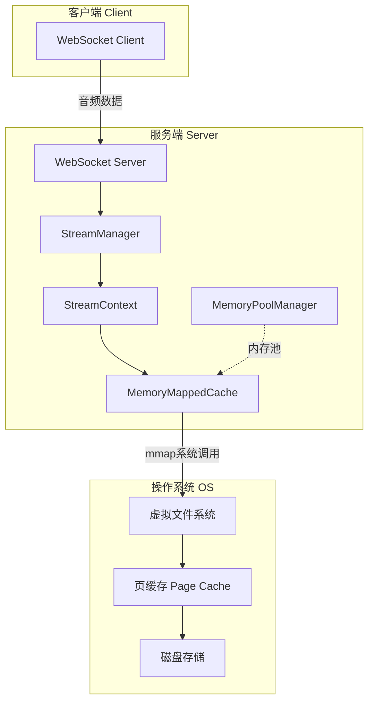
```mermaid
graph TB
    subgraph "客户端 Client"
        C[WebSocket Client]
    end
    
    subgraph "服务端 Server"
        WS[WebSocket Server]
        SM[StreamManager]
        SC[StreamContext]
        MMC[MemoryMappedCache]
        MPM[MemoryPoolManager]
    end
    
    subgraph "操作系统 OS"
        VFS[虚拟文件系统]
        PAGE[页缓存 Page Cache]
        DISK[磁盘存储]
    end
    
    C -->|音频数据| WS
    WS --> SM
    SM --> SC
    SC --> MMC
    MMC -->|mmap系统调用| VFS
    VFS --> PAGE
    PAGE --> DISK
    MPM -.->|内存池| MMC
```

## 2. 核心组件关系

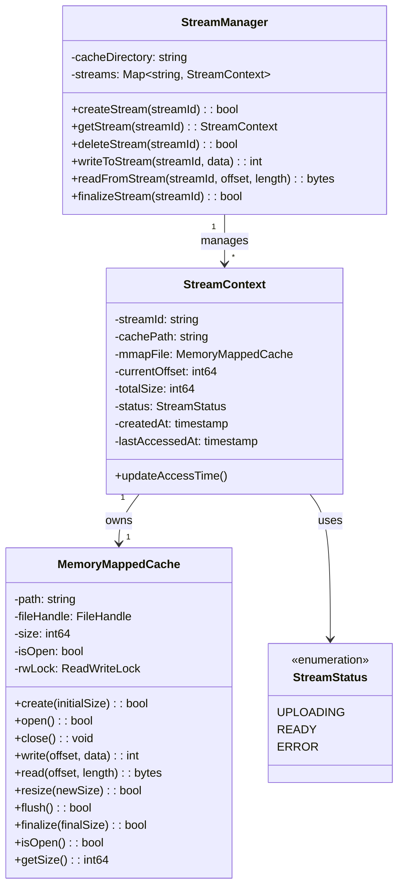
```mermaid
classDiagram
    class StreamManager {
        -cacheDirectory: string
        -streams: Map~string, StreamContext~
        +createStream(streamId): bool
        +getStream(streamId): StreamContext
        +deleteStream(streamId): bool
        +writeToStream(streamId, data): int
        +readFromStream(streamId, offset, length): bytes
        +finalizeStream(streamId): bool
    }
    
    class StreamContext {
        -streamId: string
        -cachePath: string
        -mmapFile: MemoryMappedCache
        -currentOffset: int64
        -totalSize: int64
        -status: StreamStatus
        -createdAt: timestamp
        -lastAccessedAt: timestamp
        +updateAccessTime()
    }
    
    class MemoryMappedCache {
        -path: string
        -fileHandle: FileHandle
        -size: int64
        -isOpen: bool
        -rwLock: ReadWriteLock
        +create(initialSize): bool
        +open(): bool
        +close(): void
        +write(offset, data): int
        +read(offset, length): bytes
        +resize(newSize): bool
        +flush(): bool
        +finalize(finalSize): bool
        +isOpen(): bool
        +getSize(): int64
    }
    
    class StreamStatus {
        <<enumeration>>
        UPLOADING
        READY
        ERROR
    }
    
    StreamManager "1" --> "*" StreamContext : manages
    StreamContext "1" --> "1" MemoryMappedCache : owns
    StreamContext --> StreamStatus : uses
```

## 3. 数据流程

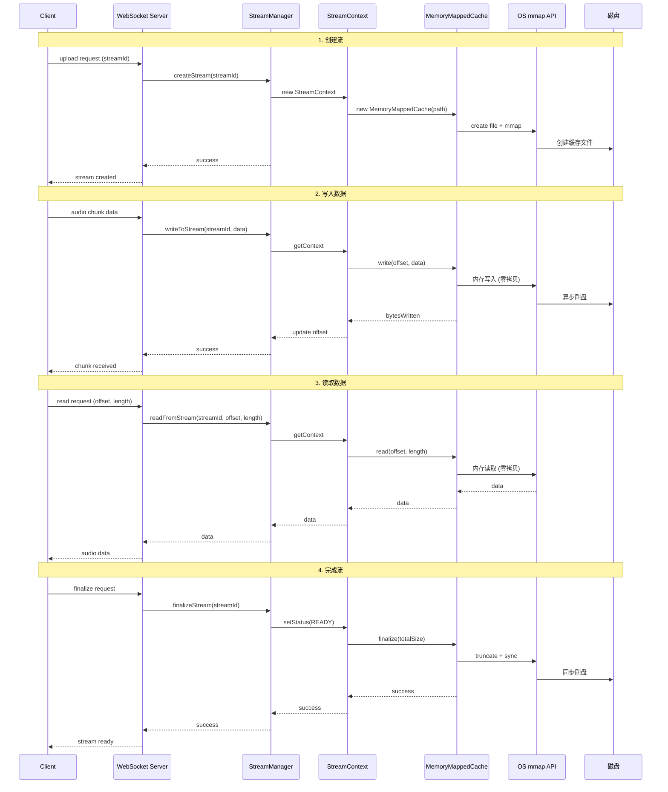
```mermaid
sequenceDiagram
    participant Client
    participant WS as WebSocket Server
    participant SM as StreamManager
    participant SC as StreamContext
    participant MMC as MemoryMappedCache
    participant OS as OS mmap API
    participant Disk as 磁盘
    
    Note over Client,Disk: 1. 创建流
    Client->>WS: upload request (streamId)
    WS->>SM: createStream(streamId)
    SM->>SC: new StreamContext
    SC->>MMC: new MemoryMappedCache(path)
    MMC->>OS: create file + mmap
    OS->>Disk: 创建缓存文件
    SM-->>WS: success
    WS-->>Client: stream created
    
    Note over Client,Disk: 2. 写入数据
    Client->>WS: audio chunk data
    WS->>SM: writeToStream(streamId, data)
    SM->>SC: getContext
    SC->>MMC: write(offset, data)
    MMC->>OS: 内存写入 (零拷贝)
    OS->>Disk: 异步刷盘
    MMC-->>SC: bytesWritten
    SC-->>SM: update offset
    SM-->>WS: success
    WS-->>Client: chunk received
    
    Note over Client,Disk: 3. 读取数据
    Client->>WS: read request (offset, length)
    WS->>SM: readFromStream(streamId, offset, length)
    SM->>SC: getContext
    SC->>MMC: read(offset, length)
    MMC->>OS: 内存读取 (零拷贝)
    OS-->>MMC: data
    MMC-->>SC: data
    SC-->>SM: data
    SM-->>WS: data
    WS-->>Client: audio data
    
    Note over Client,Disk: 4. 完成流
    Client->>WS: finalize request
    WS->>SM: finalizeStream(streamId)
    SM->>SC: setStatus(READY)
    SC->>MMC: finalize(totalSize)
    MMC->>OS: truncate + sync
    OS->>Disk: 同步刷盘
    MMC-->>SC: success
    SC-->>SM: success
    SM-->>WS: success
    WS-->>Client: stream ready
```

## 4. 12种语言实现对比

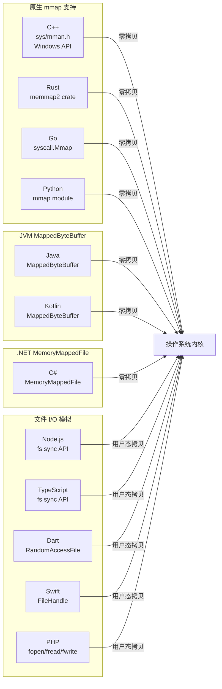
```mermaid
graph LR
    subgraph "原生 mmap 支持"
        CPP[C++<br/>sys/mman.h<br/>Windows API]
        RUST[Rust<br/>memmap2 crate]
        GO[Go<br/>syscall.Mmap]
        PYTHON[Python<br/>mmap module]
    end
    
    subgraph "JVM MappedByteBuffer"
        JAVA[Java<br/>MappedByteBuffer]
        KOTLIN[Kotlin<br/>MappedByteBuffer]
    end
    
    subgraph ".NET MemoryMappedFile"
        CSHARP[C#<br/>MemoryMappedFile]
    end
    
    subgraph "文件 I/O 模拟"
        NODEJS[Node.js<br/>fs sync API]
        TS[TypeScript<br/>fs sync API]
        DART[Dart<br/>RandomAccessFile]
        SWIFT[Swift<br/>FileHandle]
        PHP[PHP<br/>fopen/fread/fwrite]
    end
    
    CPP --> |零拷贝| KERNEL[操作系统内核]
    RUST --> |零拷贝| KERNEL
    GO --> |零拷贝| KERNEL
    PYTHON --> |零拷贝| KERNEL
    JAVA --> |零拷贝| KERNEL
    KOTLIN --> |零拷贝| KERNEL
    CSHARP --> |零拷贝| KERNEL
    NODEJS --> |用户态拷贝| KERNEL
    TS --> |用户态拷贝| KERNEL
    DART --> |用户态拷贝| KERNEL
    SWIFT --> |用户态拷贝| KERNEL
    PHP --> |用户态拷贝| KERNEL
```

## 5. 各语言实现详情

### 5.1 C++ (hello-cpp)

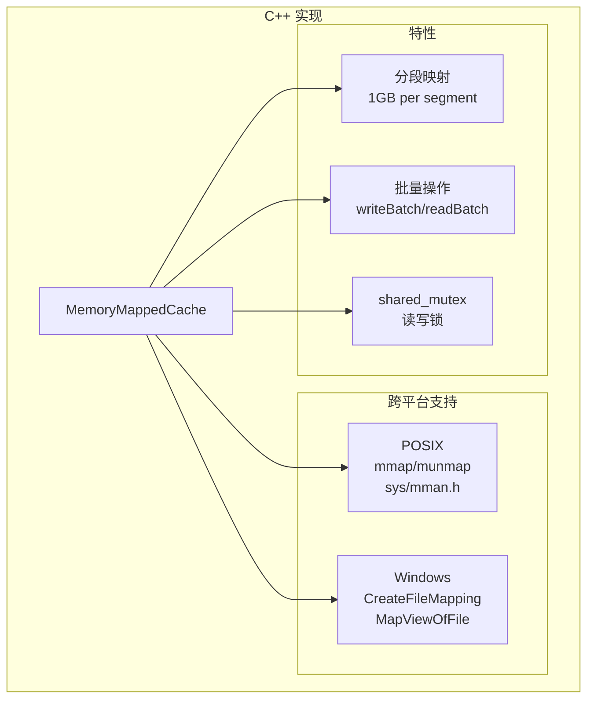
```mermaid
graph TB
    subgraph "C++ 实现"
        MEM[MemoryMappedCache]
        
        subgraph "跨平台支持"
            POSIX[POSIX<br/>mmap/munmap<br/>sys/mman.h]
            WIN[Windows<br/>CreateFileMapping<br/>MapViewOfFile]
        end
        
        subgraph "特性"
            SEG[分段映射<br/>1GB per segment]
            BATCH[批量操作<br/>writeBatch/readBatch]
            LOCK[shared_mutex<br/>读写锁]
        end
    end
    
    MEM --> POSIX
    MEM --> WIN
    MEM --> SEG
    MEM --> BATCH
    MEM --> LOCK
```

**关键实现:**
- 使用 `sys/mman.h` (POSIX) 或 Windows Memory Mapping API
- 支持大文件 (>2GB) 的分段映射
- 批量读写操作提升性能
- `std::shared_mutex` 实现读写锁

### 5.2 Rust (hello-rust)

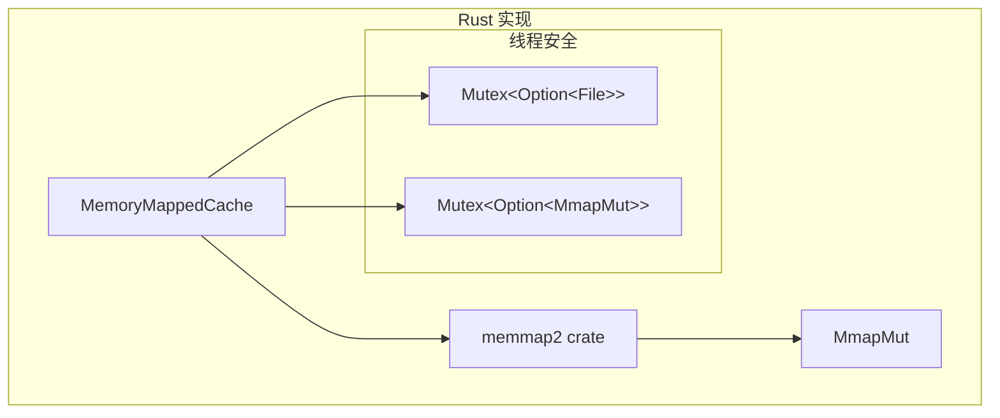
```mermaid
graph TB
    subgraph "Rust 实现"
        MEM[MemoryMappedCache]
        MEMMAP[memmap2 crate]
        MMAP[MmapMut]
        
        subgraph "线程安全"
            MUTEX[Mutex&lt;Option&lt;File&gt;&gt;]
            MMUTEX[Mutex&lt;Option&lt;MmapMut&gt;&gt;]
        end
    end
    
    MEM --> MEMMAP
    MEMMAP --> MMAP
    MEM --> MUTEX
    MEM --> MMUTEX
```

**关键实现:**
- 使用 `memmap2` crate 提供跨平台 mmap 支持
- `MmapMut` 实现可变内存映射
- Mutex 保证线程安全

### 5.3 Go (hello-go)

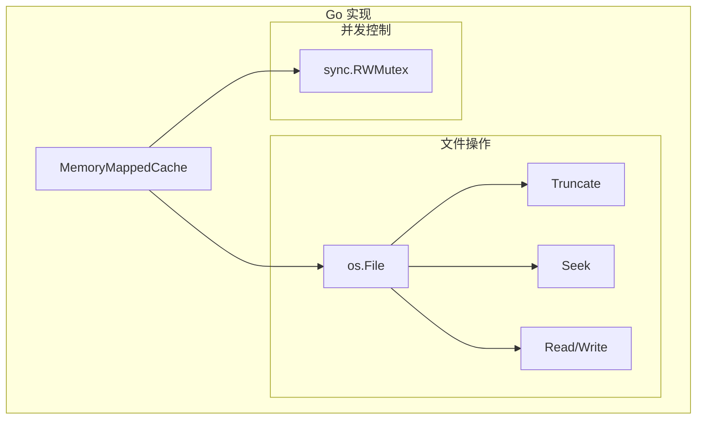
```mermaid
graph TB
    subgraph "Go 实现"
        MEM[MemoryMappedCache]
        
        subgraph "文件操作"
            FILE[os.File]
            TRUNC[Truncate]
            SEEK[Seek]
            RW[Read/Write]
        end
        
        subgraph "并发控制"
            RWMUTEX[sync.RWMutex]
        end
    end
    
    MEM --> FILE
    FILE --> TRUNC
    FILE --> SEEK
    FILE --> RW
    MEM --> RWMUTEX
```

**关键实现:**
- 使用 `os.File` 进行文件操作
- `sync.RWMutex` 实现读写锁
- 为了 Windows 兼容性，使用文件 I/O 而非平台特定 mmap

### 5.4 Python (hello-python)

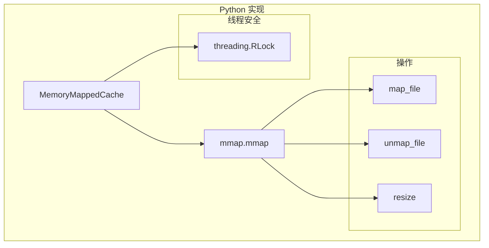
```mermaid
graph TB
    subgraph "Python 实现"
        MEM[MemoryMappedCache]
        MMAP[mmap.mmap]
        
        subgraph "线程安全"
            RLOCK[threading.RLock]
        end
        
        subgraph "操作"
            MAP[map_file]
            UNMAP[unmap_file]
            RESIZE[resize]
        end
    end
    
    MEM --> MMAP
    MEM --> RLOCK
    MMAP --> MAP
    MMAP --> UNMAP
    MMAP --> RESIZE
```

**关键实现:**
- 使用 Python 标准库 `mmap` 模块
- `threading.RLock` 可重入锁保证线程安全
- 动态调整映射大小

### 5.5 Java (hello-java)

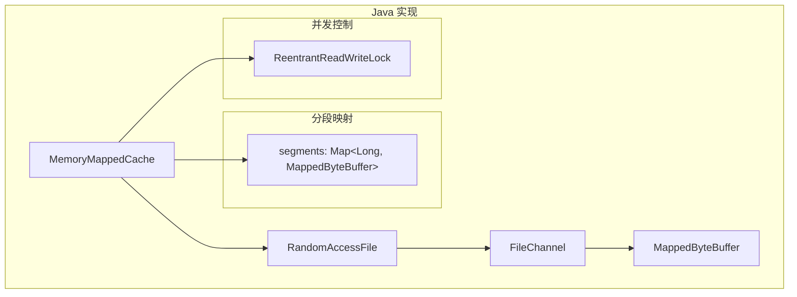
```mermaid
graph TB
    subgraph "Java 实现"
        MEM[MemoryMappedCache]
        RAF[RandomAccessFile]
        FC[FileChannel]
        MBB[MappedByteBuffer]
        
        subgraph "分段映射"
            SEG[segments: Map&lt;Long, MappedByteBuffer&gt;]
        end
        
        subgraph "并发控制"
            RWL[ReentrantReadWriteLock]
        end
    end
    
    MEM --> RAF
    RAF --> FC
    FC --> MBB
    MEM --> SEG
    MEM --> RWL
```

**关键实现:**
- `FileChannel.map()` 创建 `MappedByteBuffer`
- 支持 1GB 分段映射解决 2GB 限制
- `ReentrantReadWriteLock` 读写锁

### 5.6 Kotlin (hello-kotlin)

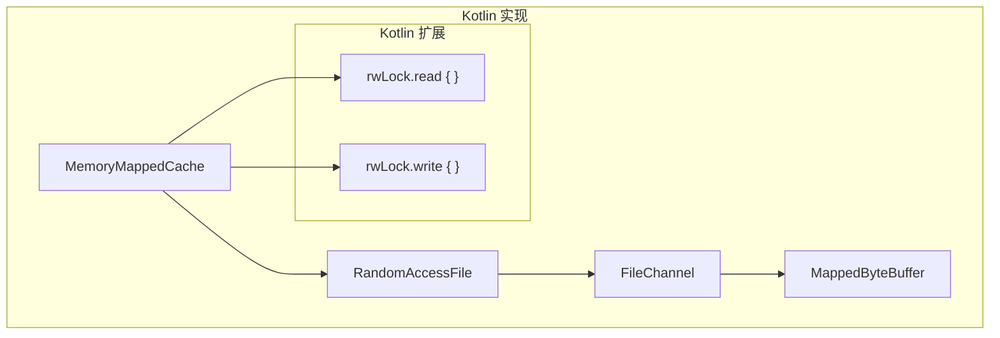
```mermaid
graph TB
    subgraph "Kotlin 实现"
        MEM[MemoryMappedCache]
        RAF[RandomAccessFile]
        FC[FileChannel]
        MBB[MappedByteBuffer]
        
        subgraph "Kotlin 扩展"
            READ["rwLock.read { }"]
            WRITE["rwLock.write { }"]
        end
    end
    
    MEM --> RAF
    RAF --> FC
    FC --> MBB
    MEM --> READ
    MEM --> WRITE
```

**关键实现:**
- 复用 Java 的 `MappedByteBuffer`
- 使用 Kotlin 扩展函数简化锁操作
- `ReentrantReadWriteLock` 配合 Kotlin concurrent 扩展

### 5.7 C# (hello-csharp)

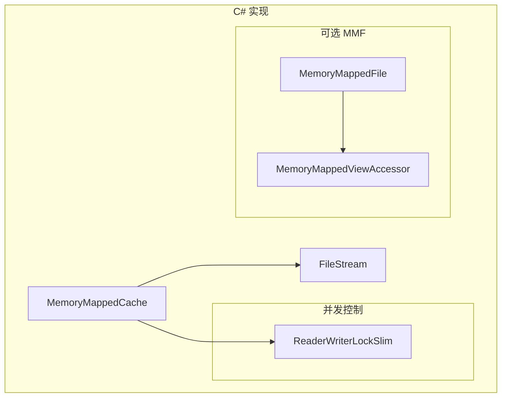
```mermaid
graph TB
    subgraph "C# 实现"
        MEM[MemoryMappedCache]
        FS[FileStream]
        
        subgraph "并发控制"
            RWLS[ReaderWriterLockSlim]
        end
        
        subgraph "可选 MMF"
            MMF[MemoryMappedFile]
            MVA[MemoryMappedViewAccessor]
        end
    end
    
    MEM --> FS
    MEM --> RWLS
    MMF --> MVA
```

**关键实现:**
- 可使用 `System.IO.MemoryMappedFiles` 命名空间
- `ReaderWriterLockSlim` 轻量级读写锁
- `FileStream` 提供基础文件操作

### 5.8 Swift (hello-swift)

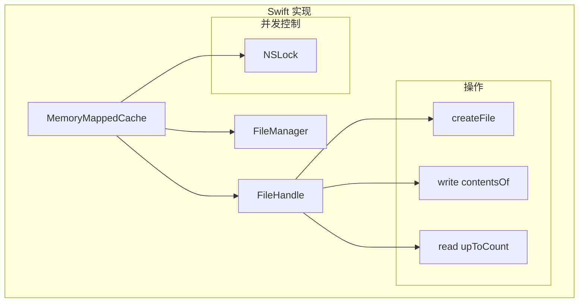
```mermaid
graph TB
    subgraph "Swift 实现"
        MEM[MemoryMappedCache]
        FH[FileHandle]
        FM[FileManager]
        
        subgraph "并发控制"
            NSLOCK[NSLock]
        end
        
        subgraph "操作"
            CREATE[createFile]
            WRITE[write contentsOf]
            READ[read upToCount]
        end
    end
    
    MEM --> FH
    MEM --> FM
    MEM --> NSLOCK
    FH --> CREATE
    FH --> WRITE
    FH --> READ
```

**关键实现:**
- `FileHandle` 进行文件读写
- `NSLock` 实现互斥锁
- Foundation 框架提供文件操作

### 5.9 Dart (hello-dart)

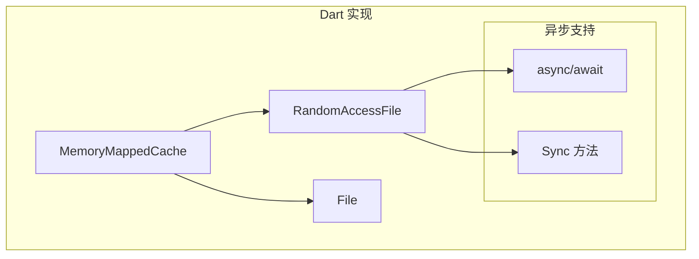
```mermaid
graph TB
    subgraph "Dart 实现"
        MEM[MemoryMappedCache]
        RAF[RandomAccessFile]
        FILE[File]
        
        subgraph "异步支持"
            ASYNC[async/await]
            SYNC[Sync 方法]
        end
    end
    
    MEM --> RAF
    MEM --> FILE
    RAF --> ASYNC
    RAF --> SYNC
```

**关键实现:**
- `dart:io` 的 `RandomAccessFile`
- 同时支持同步和异步操作
- `setPositionSync` / `writeFromSync` 同步写入

### 5.10 Node.js (hello-nodejs)

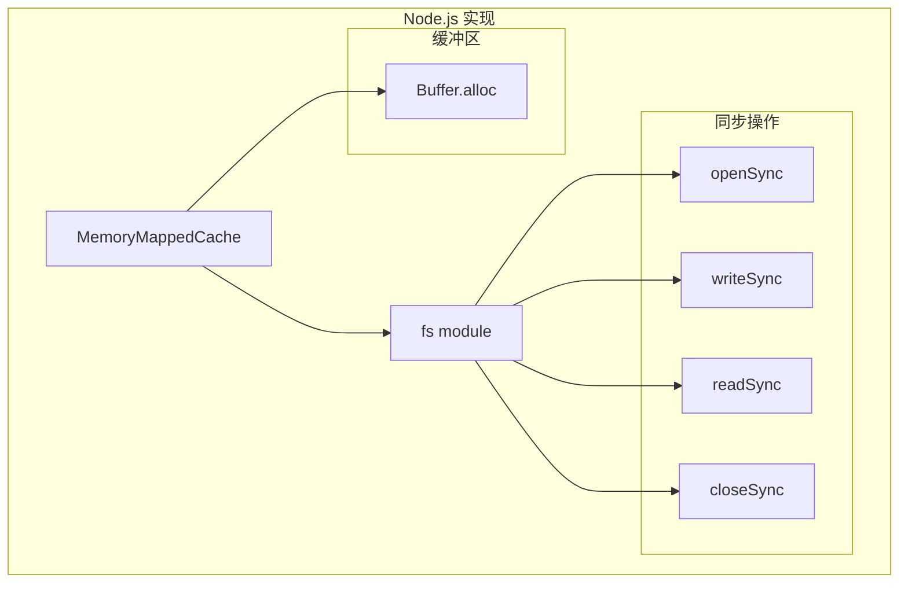
```mermaid
graph TB
    subgraph "Node.js 实现"
        MEM[MemoryMappedCache]
        FS[fs module]
        
        subgraph "同步操作"
            OPEN[openSync]
            WRITE[writeSync]
            READ[readSync]
            CLOSE[closeSync]
        end
        
        subgraph "缓冲区"
            BUF[Buffer.alloc]
        end
    end
    
    MEM --> FS
    FS --> OPEN
    FS --> WRITE
    FS --> READ
    FS --> CLOSE
    MEM --> BUF
```

**关键实现:**
- 使用 `fs` 模块同步 API
- `Buffer` 作为数据缓冲区
- 文件描述符直接操作

### 5.11 TypeScript (hello-typescript)

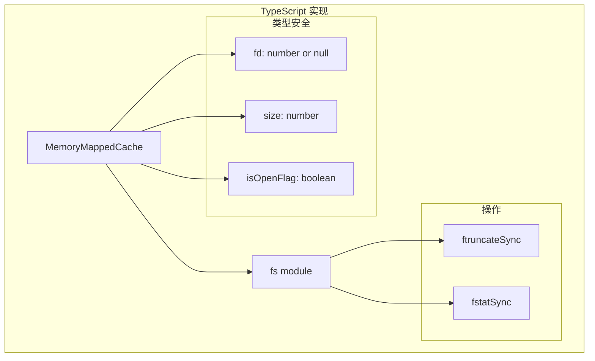
```mermaid
graph TB
    subgraph "TypeScript 实现"
        MEM[MemoryMappedCache]
        FS[fs module]
        
        subgraph "类型安全"
            FD["fd: number or null"]
            SIZE[size: number]
            FLAG[isOpenFlag: boolean]
        end
        
        subgraph "操作"
            FTRUNC[ftruncateSync]
            FSTAT[fstatSync]
        end
    end
    
    MEM --> FS
    MEM --> FD
    MEM --> SIZE
    MEM --> FLAG
    FS --> FTRUNC
    FS --> FSTAT
```

**关键实现:**
- 与 Node.js 相同的 `fs` API
- TypeScript 类型系统增强安全性
- 强类型的文件描述符和状态管理

### 5.12 PHP (hello-php)

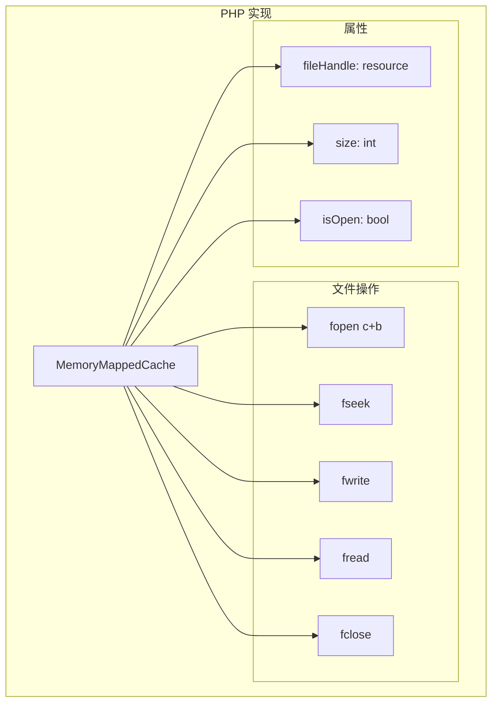
```mermaid
graph TB
    subgraph "PHP 实现"
        MEM[MemoryMappedCache]
        
        subgraph "文件操作"
            FOPEN[fopen c+b]
            FSEEK[fseek]
            FWRITE[fwrite]
            FREAD[fread]
            FCLOSE[fclose]
        end
        
        subgraph "属性"
            HANDLE[fileHandle: resource]
            SIZE[size: int]
            ISOPEN[isOpen: bool]
        end
    end
    
    MEM --> FOPEN
    MEM --> FSEEK
    MEM --> FWRITE
    MEM --> FREAD
    MEM --> FCLOSE
    MEM --> HANDLE
    MEM --> SIZE
    MEM --> ISOPEN
```

**关键实现:**
- 使用 PHP 标准文件函数
- `c+b` 模式创建/打开二进制文件
- `fseek` 定位偏移量

## 6. 线程安全机制对比

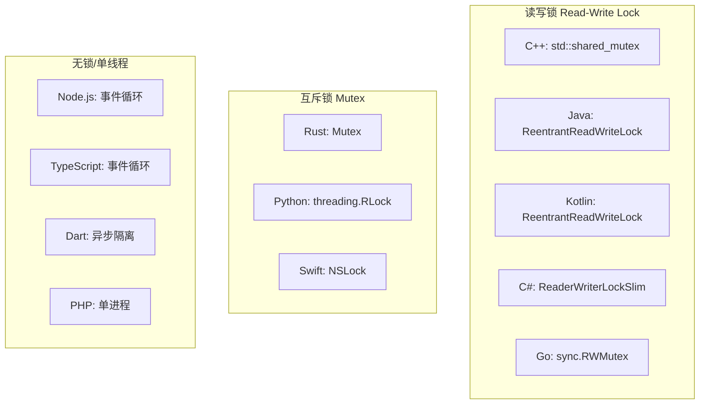
```mermaid
graph TB
    subgraph "读写锁 Read-Write Lock"
        CPP_LOCK[C++: std::shared_mutex]
        JAVA_LOCK[Java: ReentrantReadWriteLock]
        KOTLIN_LOCK[Kotlin: ReentrantReadWriteLock]
        CSHARP_LOCK[C#: ReaderWriterLockSlim]
        GO_LOCK[Go: sync.RWMutex]
    end
    
    subgraph "互斥锁 Mutex"
        RUST_LOCK[Rust: Mutex]
        PYTHON_LOCK[Python: threading.RLock]
        SWIFT_LOCK[Swift: NSLock]
    end
    
    subgraph "无锁/单线程"
        NODE_LOCK[Node.js: 事件循环]
        TS_LOCK[TypeScript: 事件循环]
        DART_LOCK[Dart: 异步隔离]
        PHP_LOCK[PHP: 单进程]
    end
```

## 7. 配置常量

所有语言均遵循统一的 mmap 实现规范 v2.0.0：

| 语言 | 默认页大小 | 最大缓存大小 | 分段大小 | 批量操作限制 |
|------|-----------|-------------|---------|-------------|
| C++ | 64MB | 8GB | 1GB | 1000 |
| Java | 64MB | 8GB | 1GB | 1000 |
| Kotlin | 64MB | 8GB | 1GB | 1000 |
| Rust | 64MB | 8GB | 1GB | 1000 |
| Python | 64MB | 8GB | 1GB | 1000 |
| Go | 64MB | 8GB | 1GB | 1000 |
| C# | 64MB | 8GB | 1GB | 1000 |
| Swift | 64MB | 8GB | 1GB | 1000 |
| Dart | 64MB | 8GB | 1GB | 1000 |
| Node.js | 64MB | 8GB | 1GB | 1000 |
| TypeScript | 64MB | 8GB | 1GB | 1000 |
| PHP | 64MB | 8GB | 1GB | 1000 |

### 常量命名对照

| 常量 | C++/Java | Kotlin | C# | Dart | 其他语言 |
|------|----------|--------|-----|------|---------|
| 默认页大小 | `SEGMENT_SIZE` | `DEFAULT_PAGE_SIZE` | `DefaultPageSize` | `defaultPageSize` | `DEFAULT_PAGE_SIZE` |
| 最大缓存 | `MAX_CACHE_SIZE` | `MAX_CACHE_SIZE` | `MaxCacheSize` | `maxCacheSize` | `MAX_CACHE_SIZE` |
| 分段大小 | `SEGMENT_SIZE` | `SEGMENT_SIZE` | `SegmentSize` | `segmentSize` | `SEGMENT_SIZE` |
| 批量限制 | `BATCH_OPERATION_LIMIT` | `BATCH_OPERATION_LIMIT` | `BatchOperationLimit` | `batchOperationLimit` | `BATCH_OPERATION_LIMIT` |

### API 方法一致性

所有 12 种语言的 `MemoryMappedCache` 均实现以下统一方法签名：

| 方法 | 描述 | 返回值 |
|------|------|--------|
| `create(initialSize)` | 创建并初始化缓存文件 | `bool` |
| `open()` | 打开现有缓存文件 | `bool` |
| `close()` | 关闭文件并释放资源 | `void` |
| `write(offset, data)` | 在指定偏移量写入数据 | `int` (写入字节数) |
| `read(offset, length)` | 从指定偏移量读取数据 | `bytes` |
| `resize(newSize)` | 调整文件大小（公开方法） | `bool` |
| `flush()` | 将映射数据刷新到磁盘 | `bool` |
| `finalize(finalSize)` | 最终化文件到指定大小 | `bool` |
| `isOpen()` | 检查文件是否已打开 | `bool` |
| `getSize()` | 获取当前文件大小 | `int64` |

## 8. 性能优化策略

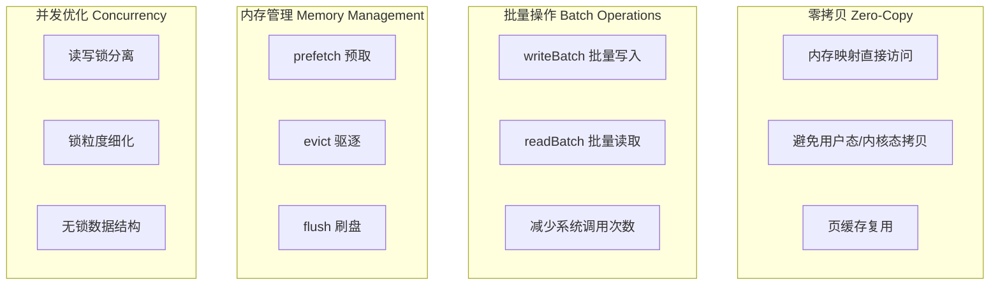
```mermaid
graph TB
    subgraph "零拷贝 Zero-Copy"
        ZC1[内存映射直接访问]
        ZC2[避免用户态/内核态拷贝]
        ZC3[页缓存复用]
    end
    
    subgraph "批量操作 Batch Operations"
        BO1[writeBatch 批量写入]
        BO2[readBatch 批量读取]
        BO3[减少系统调用次数]
    end
    
    subgraph "内存管理 Memory Management"
        MM1[prefetch 预取]
        MM2[evict 驱逐]
        MM3[flush 刷盘]
    end
    
    subgraph "并发优化 Concurrency"
        CO1[读写锁分离]
        CO2[锁粒度细化]
        CO3[无锁数据结构]
    end
```

## 9. 错误处理流程

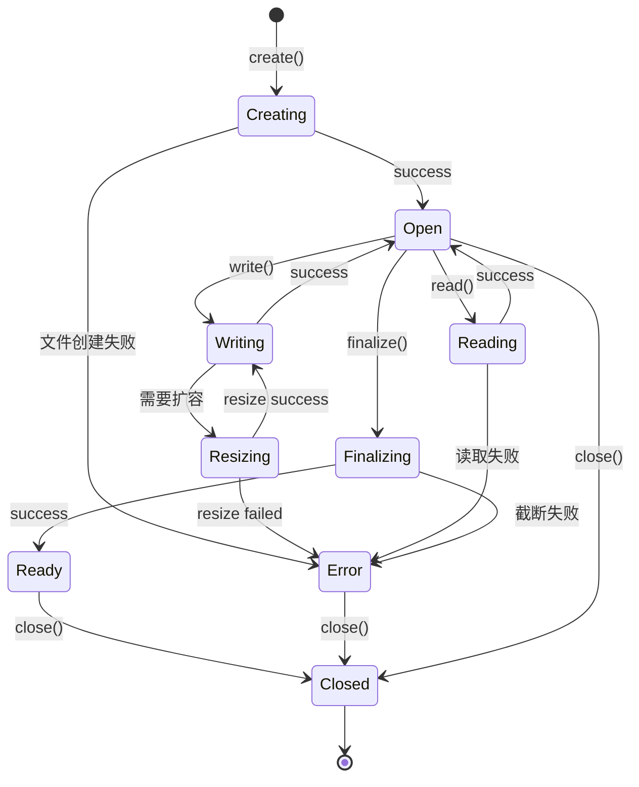
```mermaid
stateDiagram-v2
    [*] --> Creating: create()
    Creating --> Open: success
    Creating --> Error: 文件创建失败
    
    Open --> Writing: write()
    Writing --> Open: success
    Writing --> Resizing: 需要扩容
    Resizing --> Writing: resize success
    Resizing --> Error: resize failed
    
    Open --> Reading: read()
    Reading --> Open: success
    Reading --> Error: 读取失败
    
    Open --> Finalizing: finalize()
    Finalizing --> Ready: success
    Finalizing --> Error: 截断失败
    
    Ready --> Closed: close()
    Error --> Closed: close()
    Open --> Closed: close()
    
    Closed --> [*]
```

## 10. 总结

### 实现方式分类

1. **原生 mmap 实现** (C++, Rust, Python, Go*)
   - 真正的零拷贝
   - 直接内存映射
   - 最佳性能

2. **JVM/CLR 内存映射** (Java, Kotlin, C#)
   - 通过运行时提供的 API
   - 接近原生性能
   - 跨平台一致性

3. **文件 I/O 模拟** (Node.js, TypeScript, Dart, Swift, PHP)
   - 使用同步文件操作模拟
   - 实现简单
   - 性能略低但足够

### 共同设计模式

- **StreamManager**: 单例模式管理所有流
- **StreamContext**: 流的元数据和状态
- **MemoryMappedCache**: 底层缓存抽象
- **读写锁**: 多读单写并发控制
- **动态扩容**: 按需增长文件大小
