# Memory-Mapped Cache (mmap) 音频流缓存实现原理

本文档总结了12种编程语言中使用 mmap（内存映射）技术缓存音频流的实现原理。

## 1. 整体架构

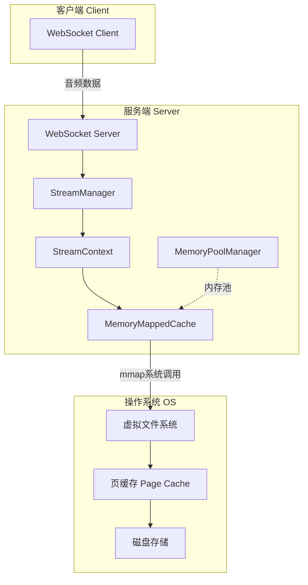

## 2. 核心组件关系

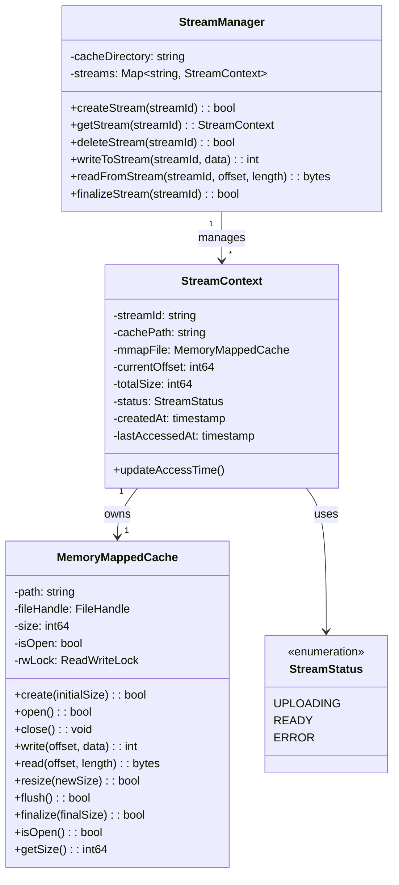

## 3. 数据流程

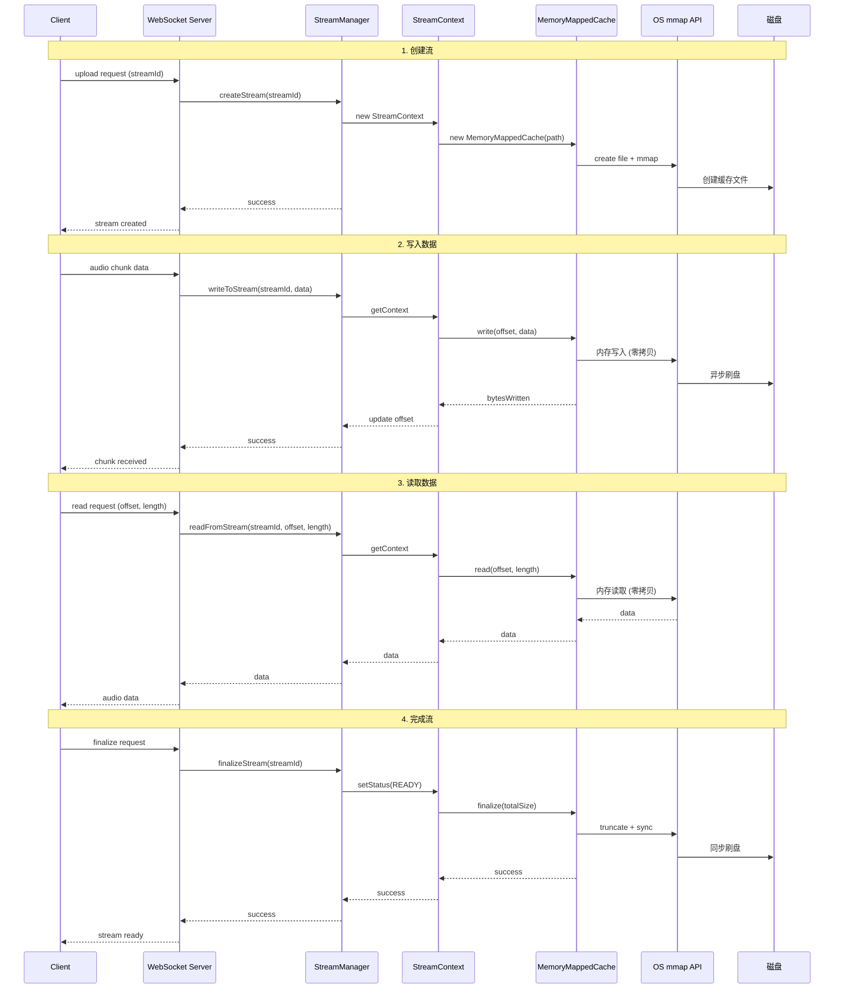

## 4. 12种语言实现对比

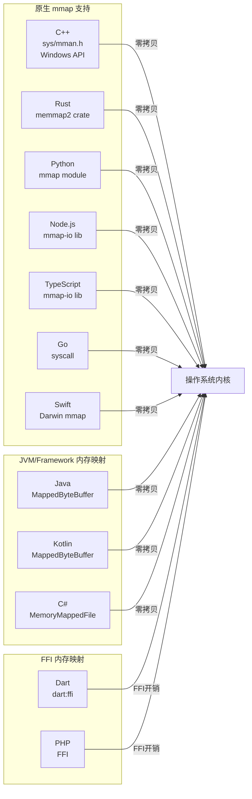

## 5. 各语言实现详情

### 5.1 C++ (hello-cpp)

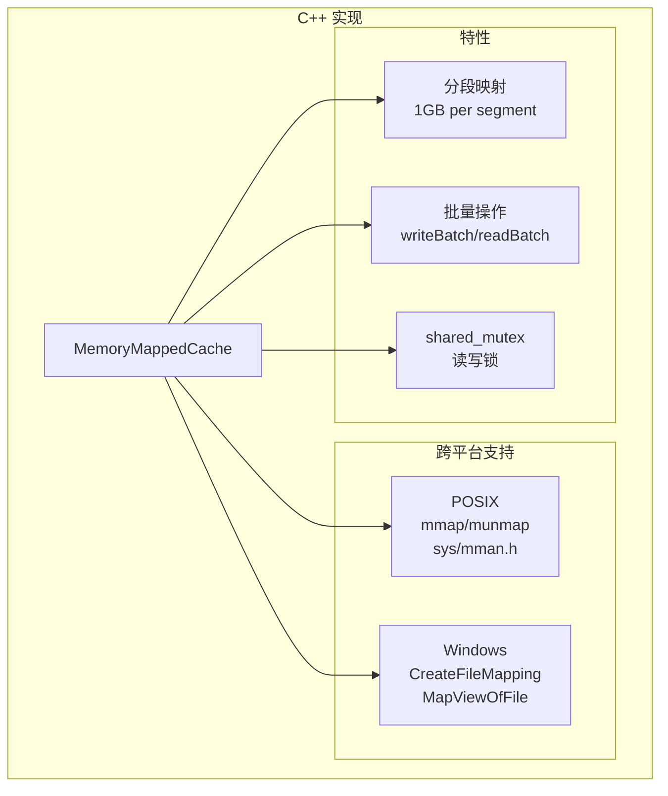

**关键实现:**
- 使用 `sys/mman.h` (POSIX) 或 Windows Memory Mapping API
- 支持大文件 (>2GB) 的分段映射
- 批量读写操作提升性能
- `std::shared_mutex` 实现读写锁

### 5.2 Rust (hello-rust)

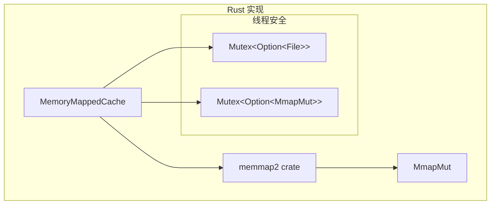

**关键实现:**
- 使用 `memmap2` crate 提供跨平台 mmap 支持
- `MmapMut` 实现可变内存映射
- Mutex 保证线程安全

### 5.3 Go (hello-go)

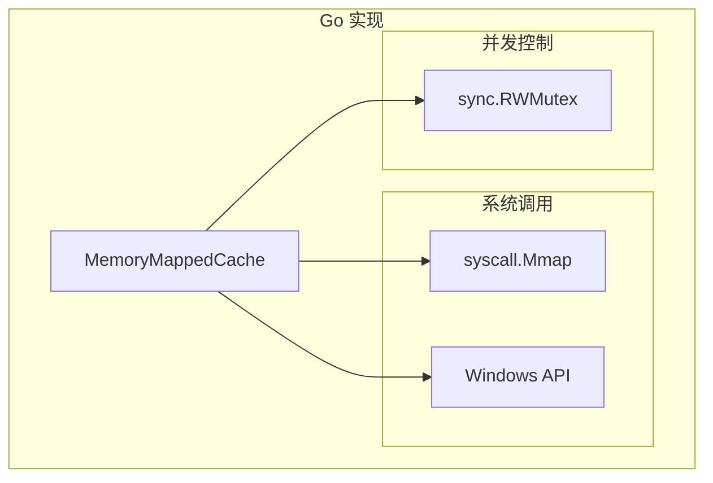

**关键实现:**
- 使用 `syscall.Mmap` (Unix) 和 Windows API (`CreateFileMapping`)
- 实现了真正的原生内存映射
- `sync.RWMutex` 保证并发安全

### 5.4 Python (hello-python)

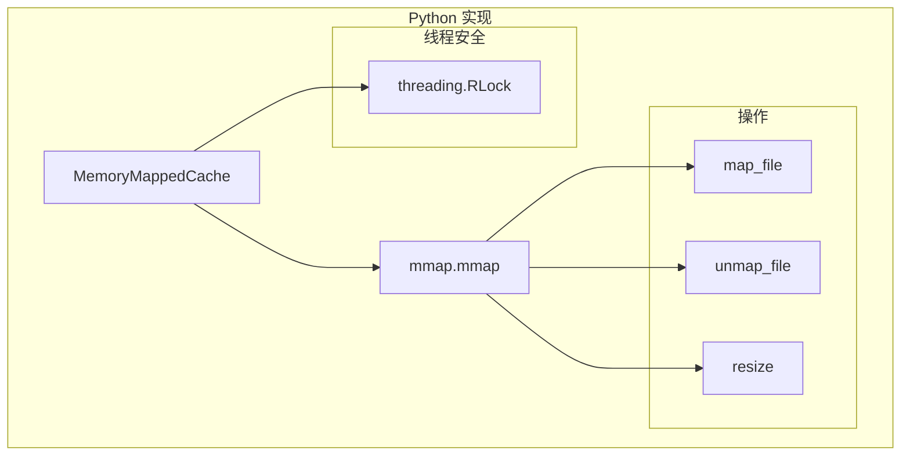

**关键实现:**
- 使用 Python 标准库 `mmap` 模块
- `threading.RLock` 可重入锁保证线程安全
- 动态调整映射大小

### 5.5 Java (hello-java)

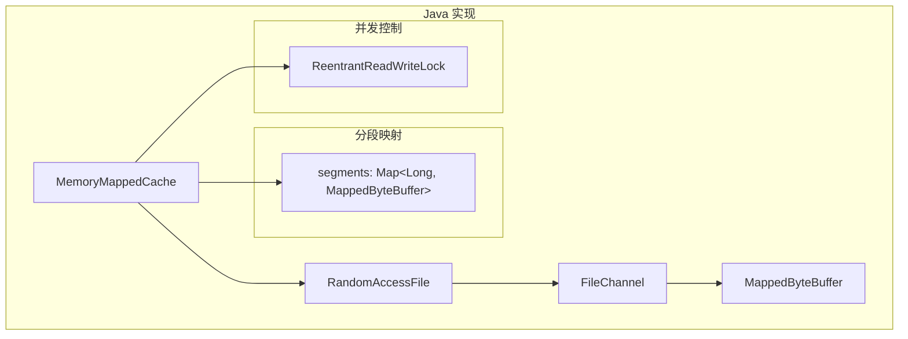

**关键实现:**
- `FileChannel.map()` 创建 `MappedByteBuffer`
- 支持 1GB 分段映射解决 2GB 限制
- `ReentrantReadWriteLock` 读写锁

### 5.6 Kotlin (hello-kotlin)

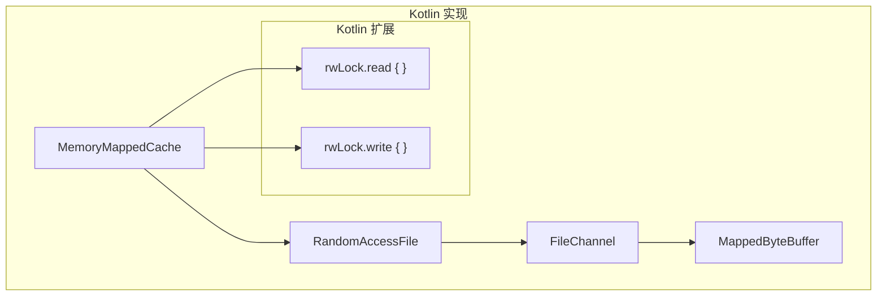

**关键实现:**
- 复用 Java 的 `MappedByteBuffer`
- 使用 Kotlin 扩展函数简化锁操作
- `ReentrantReadWriteLock` 配合 Kotlin concurrent 扩展

### 5.7 C# (hello-csharp)

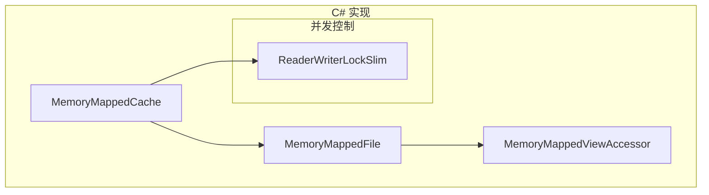

**关键实现:**
- 使用 .NET `MemoryMappedFile`
- `CreateFromFile` 创建文件映射
- `ReaderWriterLockSlim` 轻量级读写锁
- `Dispose` + Re-create 实现动态扩容

### 5.8 Swift (hello-swift)

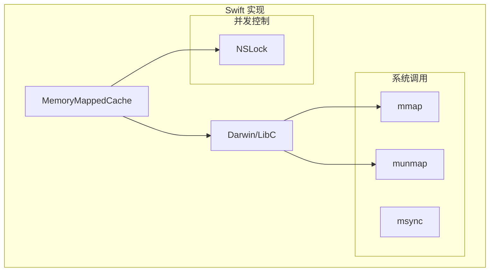

**关键实现:**
- 直接调用 `Darwin` 模块的 `mmap` C API
- `UnsafeMutableRawPointer` 管理内存指针
- `NSLock` 互斥锁

### 5.9 Dart (hello-dart)

```mermaid
graph TB
    subgraph "Dart 实现"
        MEM[MemoryMappedCache]
        FFI[dart:ffi]
        
        subgraph "Native Bindings"
            LIBC[libc (mmap)]
            WIN[kernel32 (CreateFileMapping)]
        end
    end
    
    MEM --> FFI
    FFI --> LIBC
    FFI --> WIN
```

**关键实现:**
- 使用 `dart:ffi` 调用系统原生 API
- 跨平台支持 (POSIX mmap / Windows API)
- 真正的原生内存映射体验

### 5.10 Node.js (hello-nodejs)

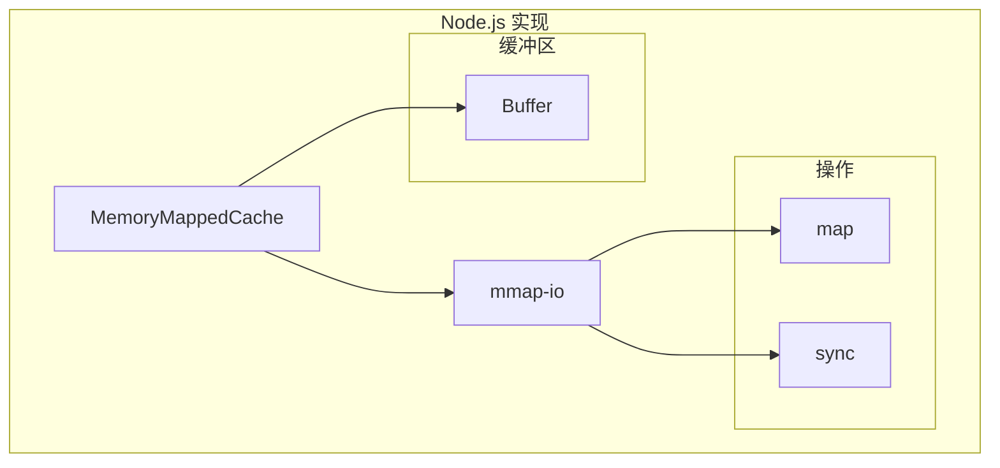

**关键实现:**
- 使用 `mmap-io` 库提供原生 mmap 支持
- 实现真正的零拷贝内存映射
- 高性能文件访问

### 5.11 TypeScript (hello-typescript)

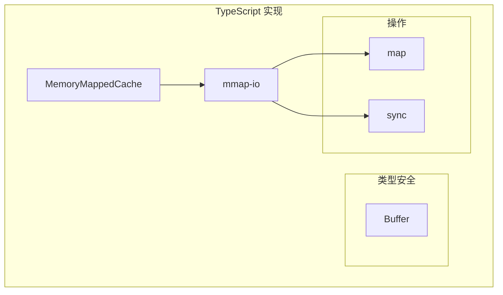

**关键实现:**
- 采用与 Node.js 相同的 `mmap-io` 库
- 替换了原有的 `fs` 同步 API 实现
- 完整的原生 mmap 支持

### 5.12 PHP (hello-php)

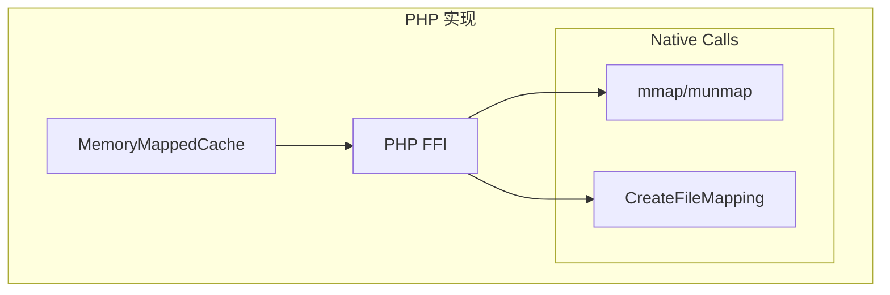

**关键实现:**
- 使用 PHP 7.4+ `FFI` 扩展
- 直接调用 C 语言标准库或 Windows API
- 实现内存映射，突破 PHP 文件操作限制

## 6. 线程安全机制对比

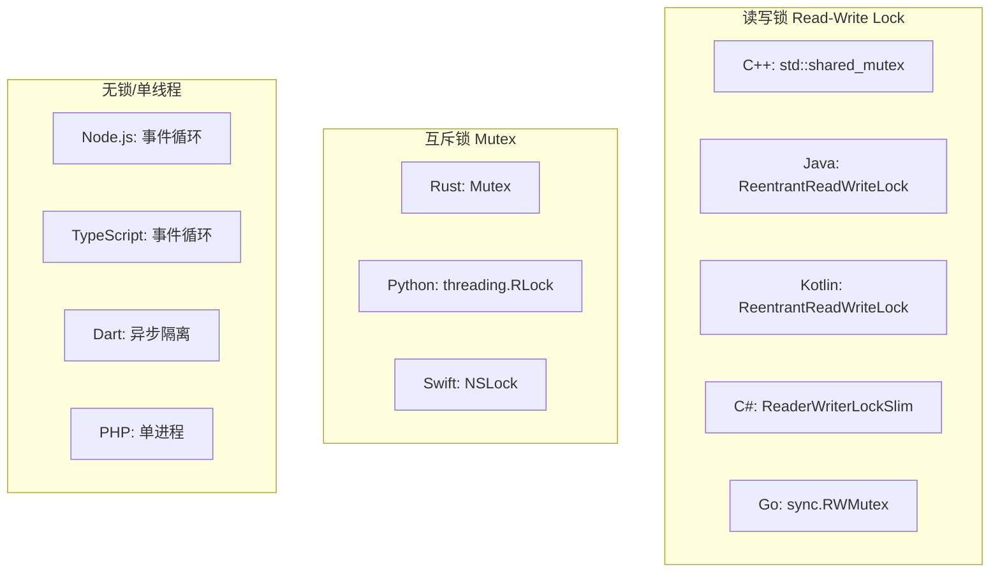

## 7. 配置常量

所有语言均遵循统一的 mmap 实现规范 v2.0.0：

| 语言 | 默认页大小 | 最大缓存大小 | 分段大小 | 批量操作限制 |
|------|-----------|-------------|---------|-------------|
| C++ | 64MB | 8GB | 1GB | 1000 |
| Java | 64MB | 8GB | 1GB | 1000 |
| Kotlin | 64MB | 8GB | 1GB | 1000 |
| Rust | 64MB | 8GB | 1GB | 1000 |
| Python | 64MB | 8GB | 1GB | 1000 |
| Go | 64MB | 8GB | 1GB | 1000 |
| C# | 64MB | 8GB | 1GB | 1000 |
| Swift | 64MB | 8GB | 1GB | 1000 |
| Dart | 64MB | 8GB | 1GB | 1000 |
| Node.js | 64MB | 8GB | 1GB | 1000 |
| TypeScript | 64MB | 8GB | 1GB | 1000 |
| PHP | 64MB | 8GB | 1GB | 1000 |

### 常量命名对照

| 常量 | C++/Java | Kotlin | C# | Dart | 其他语言 |
|------|----------|--------|-----|------|---------|
| 默认页大小 | `SEGMENT_SIZE` | `DEFAULT_PAGE_SIZE` | `DefaultPageSize` | `defaultPageSize` | `DEFAULT_PAGE_SIZE` |
| 最大缓存 | `MAX_CACHE_SIZE` | `MAX_CACHE_SIZE` | `MaxCacheSize` | `maxCacheSize` | `MAX_CACHE_SIZE` |
| 分段大小 | `SEGMENT_SIZE` | `SEGMENT_SIZE` | `SegmentSize` | `segmentSize` | `SEGMENT_SIZE` |
| 批量限制 | `BATCH_OPERATION_LIMIT` | `BATCH_OPERATION_LIMIT` | `BatchOperationLimit` | `batchOperationLimit` | `BATCH_OPERATION_LIMIT` |

### API 方法一致性

所有 12 种语言的 `MemoryMappedCache` 均实现以下统一方法签名：

| 方法 | 描述 | 返回值 |
|------|------|--------|
| `create(initialSize)` | 创建并初始化缓存文件 | `bool` |
| `open()` | 打开现有缓存文件 | `bool` |
| `close()` | 关闭文件并释放资源 | `void` |
| `write(offset, data)` | 在指定偏移量写入数据 | `int` (写入字节数) |
| `read(offset, length)` | 从指定偏移量读取数据 | `bytes` |
| `resize(newSize)` | 调整文件大小（公开方法） | `bool` |
| `flush()` | 将映射数据刷新到磁盘 | `bool` |
| `finalize(finalSize)` | 最终化文件到指定大小 | `bool` |
| `isOpen()` | 检查文件是否已打开 | `bool` |
| `getSize()` | 获取当前文件大小 | `int64` |

## 8. 性能优化策略

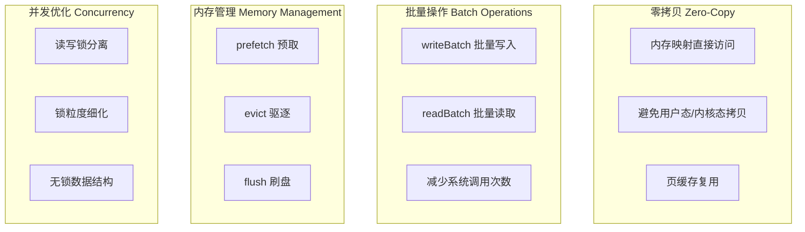

## 9. 错误处理流程

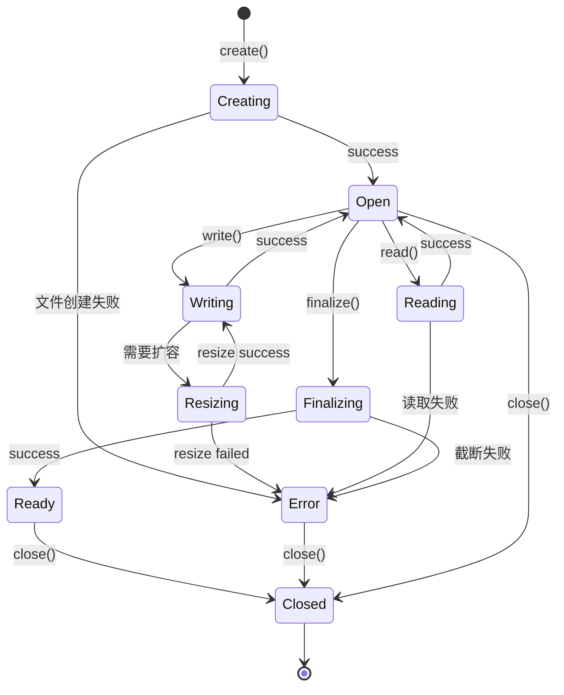

## 10. 总结
### 实现方式分类
1. **原生 mmap 实现** (C++, Rust, Python, Node.js, Swift, Go)
   - 真正的零拷贝
   - 直接内存映射 (OS API / Syscall)
   - 最佳性能
   - *Node.js/TypeScript 使用 mmap-io 库*
   - *Go 使用 syscall (Unix) / syscall (Windows)*
   - *Swift 使用 Darwin mmap*

2. **JVM/Framework 内存映射** (Java, Kotlin, C#)
   - 通过运行时/框架提供的 API
   - 接近原生性能
   - 跨平台一致性
   - *Java/Kotlin 使用 FileChannel.map (MappedByteBuffer)*
   - *C# 使用 MemoryMappedFile*

3. **FFI 内存映射** (Dart, PHP)
   - 通过 FFI 调用系统 mmap
   - 性能取决于 FFI 开销，但底层为原生 mmap
   - *Dart 使用 dart:ffi*
   - *PHP 使用 FFI 扩展*

### 共同设计模式
- **StreamManager**: 单例模式管理所有流
- **StreamContext**: 流的元数据和状态
- **MemoryMappedCache**: 底层缓存抽象
- **读写锁**: 多读单写并发控制
- **动态扩容**: 按需增长文件大小

| 语言 | 实现方式 | 关键库/API | 扩容策略 | 线程安全 |
| :--- | :--- | :--- | :--- | :--- |
| **C++** | Native (POSIX/Win32) | `mmap` / `CreateFileMapping` | `ftruncate` + Remap | `std::shared_mutex` |
| **Java** | NIO | `MappedByteBuffer` | Re-map | `ReentrantReadWriteLock` |
| **Kotlin** | NIO | `MappedByteBuffer` | Re-map | `ReentrantReadWriteLock` |
| **Python** | Native Module | `mmap` module | `resize` | `threading.RLock` |
| **Rust** | Native Crate | `memmap2` | `mremap` (unix) / Re-map | `std::sync::Mutex` |
| **Node.js** | Native Wrapper | `mmap-io` | `ftruncate` + Remap | 单线程 (Async I/O) |
| **Go** | Native Syscall | `syscall.Mmap` / `CreateFileMapping` | Unmap + Truncate + Remap | `sync.RWMutex` |
| **C#** | Framework API | `MemoryMappedFile` | Dispose + Resize + Re-create | `ReaderWriterLockSlim` |
| **TypeScript** | Native Wrapper | `mmap-io` | `ftruncate` + Remap | 单线程 (Async I/O) |
| **Swift** | Native / LibC | `Darwin.mmap` | Unmap + Truncate + Remap | `NSLock` |
| **Dart** | FFI | `dart:ffi` (libc/kernel32) | FFI Call + Remap | `Isolate` / `Lock` (?) |
| **PHP** | FFI | `FFI::cdef` (libc/kernel32) | FFI Call + Remap | Flock / None |

### 性能等级
- **Tier 1 (Native/Zero-copy):** C++, Rust, Go, Swift, Python, Node.js/TS (mmap-io)
- **Tier 1.5 (Framework Managed):** Java, Kotlin, C#
- **Tier 2 (FFI Access):** Dart, PHP (depend on FFI overhead)

*注：v2.0.0 版本已移除所有基于 File I/O 的模拟实现，全线升级为 Native/Framework 内存映射。*
