# Memory-Mapped Cache

## 架构设计

### 组件层次

```
应用层 (Application)
    ↓
WebSocket Server
    ↓
StreamManager (流生命周期管理)
    ↓
MemoryMappedCache (每个流一个实例)
    ↓
操作系统 mmap API

独立组件: MemoryPoolManager (缓冲区复用)
```

### 组件职责

| 组件 | 职责 | 生命周期 |
|------|------|----------|
| **MemoryMappedCache** | 单个文件的内存映射操作 | 每个流一个实例 |
| **StreamContext** | 流的元数据和状态 | 由 StreamManager 管理 |
| **StreamManager** | 多个流的生命周期管理 | 实例化，应用级单例 |
| **MemoryPoolManager** | 临时缓冲区的复用管理 | 实例化，应用级单例 |

### 架构总览图

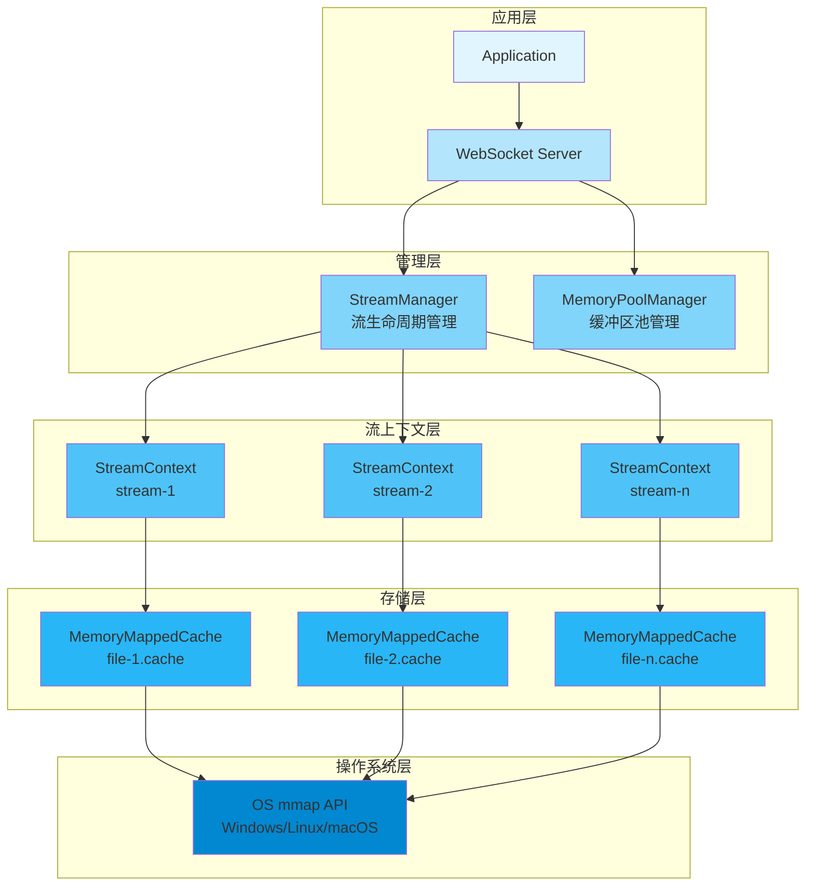

### 核心组件类图

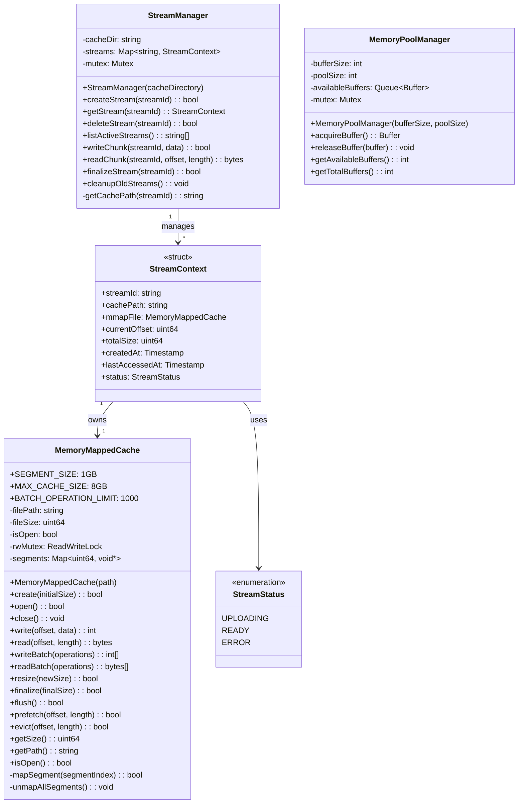

### 数据流程图

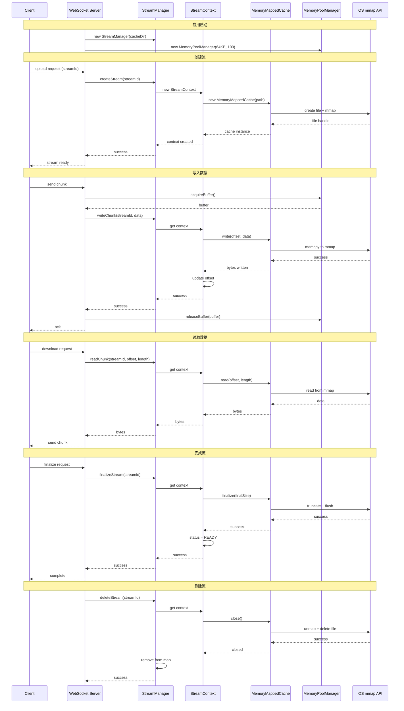

### 线程安全机制图

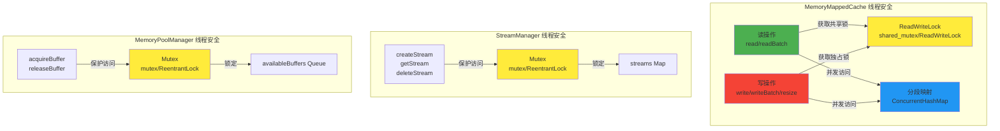

### 内存分段映射图

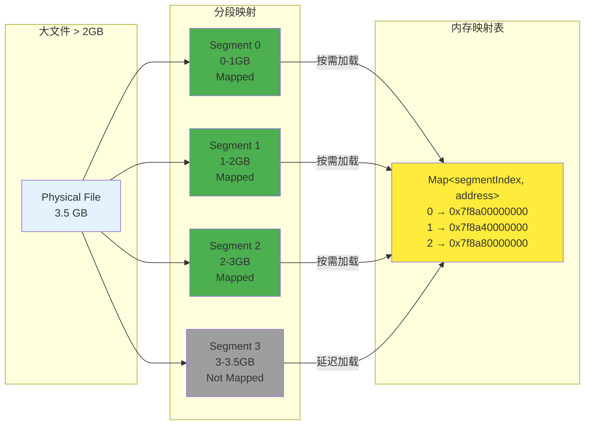

### 生命周期状态图

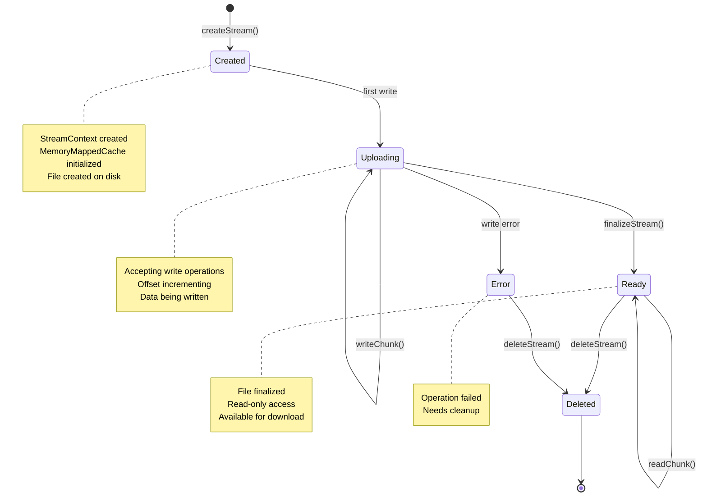

### 性能优化策略图


### 错误处理流程图

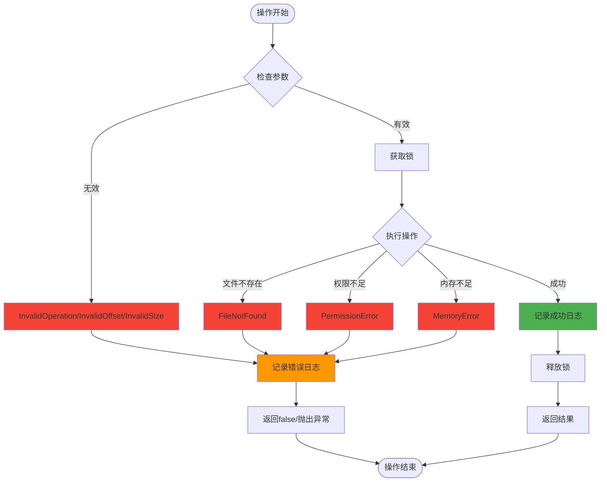

### 平台适配层图

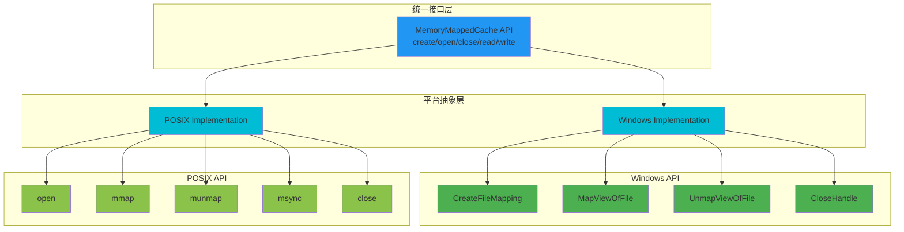

---

## 配置参数

### MemoryMappedCache

```
SEGMENT_SIZE = 1GB              // 分段大小
MAX_CACHE_SIZE = 8GB            // 最大缓存大小
BATCH_OPERATION_LIMIT = 1000    // 批量操作限制
```

### StreamManager

```
CLEANUP_AGE = 24 hours          // 清理时间（超过此时间的流将被删除）
```

### MemoryPoolManager

```
DEFAULT_BUFFER_SIZE = 64KB      // 默认缓冲区大小
DEFAULT_POOL_SIZE = 100         // 默认池大小
```


---

## 统一端到端验证方式 (Unified End-to-End Verification)

### 概述 (Overview)

端到端验证是确保客户端实现正确性的关键步骤。本节定义了一个标准化的验证流程，适用于所有编程语言的客户端实现（C++、Java 及未来的其他语言）。

验证流程包括：
1. **上传阶段**：将测试文件上传到服务器
2. **下载阶段**：从服务器下载相同的文件
3. **完整性验证**：使用 SHA-256 校验和验证文件一致性
4. **性能测量**：测量上传和下载吞吐量
5. **结果报告**：生成标准化的验证报告

End-to-end verification is a critical step to ensure client implementation correctness. This section defines a standardized verification workflow applicable to all programming language client implementations (C++, Java, and future languages).

The verification workflow includes:
1. **Upload Phase**: Upload test file to server
2. **Download Phase**: Download the same file from server
3. **Integrity Verification**: Verify file consistency using SHA-256 checksum
4. **Performance Measurement**: Measure upload and download throughput
5. **Result Reporting**: Generate standardized verification report

### 验证工作流程 (Verification Workflow)

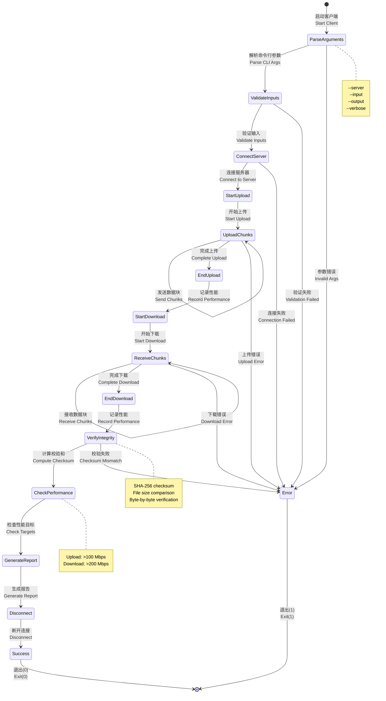

### 完整生命周期流程 (Complete Lifecycle Flow)

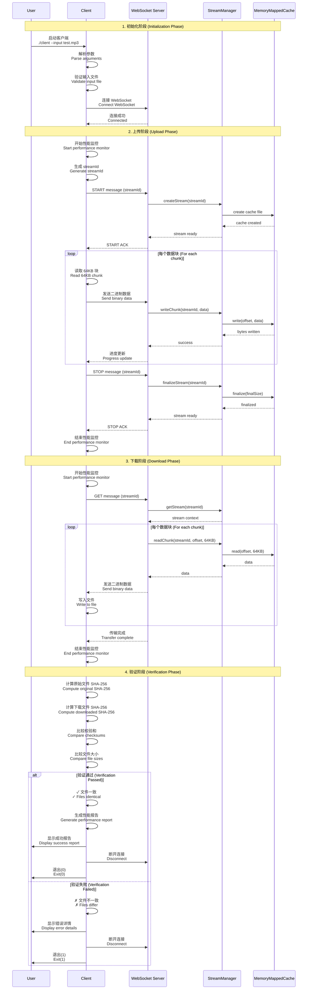


### 命令行接口标准 (Command-Line Interface Standards)

所有客户端实现必须支持以下标准命令行选项：

All client implementations MUST support the following standard command-line options:

#### 必需选项 (Required Options)

| 选项 (Option) | 参数 (Argument) | 说明 (Description) | 默认值 (Default) |
|--------------|----------------|-------------------|-----------------|
| `--input` | `<file_path>` | 输入文件路径（上传的文件）<br/>Input file path (file to upload) | 无 (None) - 必需 (Required) |

#### 可选选项 (Optional Options)

| 选项 (Option) | 参数 (Argument) | 说明 (Description) | 默认值 (Default) |
|--------------|----------------|-------------------|-----------------|
| `--server` | `<uri>` | WebSocket 服务器 URI<br/>WebSocket server URI | `ws://localhost:8080/audio` |
| `--output` | `<file_path>` | 输出文件路径（下载的文件）<br/>Output file path (downloaded file) | `audio/output/output-{timestamp}-test.mp3` |
| `--verbose` 或 `-v` | 无 (None) | 启用详细日志输出<br/>Enable verbose logging | 禁用 (Disabled) |
| `--help` 或 `-h` | 无 (None) | 显示帮助信息<br/>Display help message | N/A | 

### 验证标准 (Verification Criteria)

#### 文件完整性验证 (File Integrity Verification)

文件完整性验证是端到端测试的核心，确保上传和下载的文件完全一致。

File integrity verification is the core of end-to-end testing, ensuring uploaded and downloaded files are identical.

**验证步骤 (Verification Steps):**

1. **计算原始文件校验和 (Compute Original File Checksum)**
   - 算法：SHA-256
   - 输入：原始输入文件的全部字节
   - 输出：64 字符的十六进制字符串

2. **计算下载文件校验和 (Compute Downloaded File Checksum)**
   - 算法：SHA-256
   - 输入：下载输出文件的全部字节
   - 输出：64 字符的十六进制字符串

3. **比较文件大小 (Compare File Sizes)**
   - 原始文件大小（字节）
   - 下载文件大小（字节）
   - 必须完全相等

4. **比较校验和 (Compare Checksums)**
   - 原始文件 SHA-256
   - 下载文件 SHA-256
   - 必须完全匹配（大小写不敏感）

**验证报告格式 (Verification Report Format):**

```
=== Verifying File Integrity ===
Original file: audio/input/test.mp3
Downloaded file: audio/output/output-20260124-103015-test.mp3
Original size: 5242880 bytes
Downloaded size: 5242880 bytes
Original checksum (SHA-256): a1b2c3d4e5f6g7h8i9j0k1l2m3n4o5p6q7r8s9t0u1v2w3x4y5z6a7b8c9d0e1f2
Downloaded checksum (SHA-256): a1b2c3d4e5f6g7h8i9j0k1l2m3n4o5p6q7r8s9t0u1v2w3x4y5z6a7b8c9d0e1f2
✓ File verification PASSED - Files are identical
```

**成功标准 (Success Criteria):**

- ✅ 文件大小相等 (File sizes are equal)
- ✅ SHA-256 校验和匹配 (SHA-256 checksums match)
- ✅ 无数据损坏 (No data corruption)
- ✅ 无字节丢失或添加 (No bytes lost or added)

**失败场景 (Failure Scenarios):**

```
=== Verifying File Integrity ===
Original file: audio/input/test.mp3
Downloaded file: audio/output/output-20260124-103520-test.mp3
Original size: 5242880 bytes
Downloaded size: 5242816 bytes
Original checksum (SHA-256): a1b2c3d4e5f6g7h8i9j0k1l2m3n4o5p6q7r8s9t0u1v2w3x4y5z6a7b8c9d0e1f2
Downloaded checksum (SHA-256): f2e1d0c9b8a7z6y5x4w3v2u1t0s9r8q7p6o5n4m3l2k1j0i9h8g7f6e5d4c3b2a1
✗ File verification FAILED
  Reason: File size mismatch (expected 5242880, got 5242816)
  Reason: Checksum mismatch
```

#### 校验和算法规范 (Checksum Algorithm Specification)

**SHA-256 实现要求 (SHA-256 Implementation Requirements):**

1. **算法标准 (Algorithm Standard)**
   - 遵循 FIPS 180-4 标准
   - 256 位（32 字节）输出
   - 64 字符十六进制表示

2. **实现库 (Implementation Libraries)**
   - **C++**: OpenSSL (`SHA256()` 函数)
   - **Java**: `java.security.MessageDigest` ("SHA-256")
   - **Python**: `hashlib.sha256()`
   - **Node.js**: `crypto.createHash('sha256')`
   - **Go**: `crypto/sha256`
   - **Rust**: `sha2` crate

3. **计算方式 (Computation Method)**
   ```
   1. 打开文件以二进制模式读取
   2. 初始化 SHA-256 上下文
   3. 分块读取文件（推荐 64KB 块）
   4. 对每个块更新 SHA-256 上下文
   5. 完成计算并获取最终哈希值
   6. 转换为十六进制字符串（小写）
   ```
 

#### 验证决策逻辑 (Verification Decision Logic)

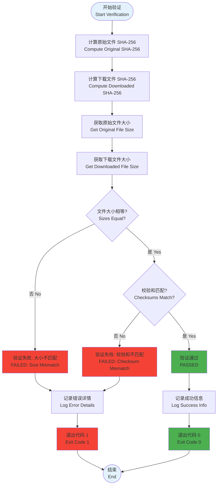


### 性能目标和测量 (Performance Targets and Measurement)

#### 性能目标 (Performance Targets)

所有客户端实现应该努力达到以下性能目标：

All client implementations should strive to meet the following performance targets:

| 指标 (Metric) | 目标值 (Target) | 说明 (Description) |
|--------------|----------------|-------------------|
| **上传吞吐量 (Upload Throughput)** | > 100 Mbps | 从客户端到服务器的数据传输速率<br/>Data transfer rate from client to server |
| **下载吞吐量 (Download Throughput)** | > 200 Mbps | 从服务器到客户端的数据传输速率<br/>Data transfer rate from server to client |
| **连接建立时间 (Connection Time)** | < 1 秒 (second) | WebSocket 连接建立的时间<br/>Time to establish WebSocket connection |
| **端到端延迟 (End-to-End Latency)** | < 5 秒 (seconds) | 完整上传-下载-验证周期的总时间（5MB 文件）<br/>Total time for complete upload-download-verify cycle (5MB file) |

**注意 (Note):** 性能目标是指导性的，实际性能取决于网络条件、硬件性能和文件大小。未达到目标不会导致验证失败，但会记录警告。

Performance targets are guidelines; actual performance depends on network conditions, hardware performance, and file size. Not meeting targets does not cause verification failure but will log a warning.

#### 吞吐量计算公式 (Throughput Calculation Formula)

**吞吐量 (Throughput) = (文件大小 × 8) / (传输时间 × 1,000,000)**

其中 (Where):
- 文件大小 (File Size): 字节 (bytes)
- 传输时间 (Transfer Time): 毫秒 (milliseconds)
- 结果单位 (Result Unit): Mbps (兆比特每秒 / Megabits per second)

**示例计算 (Example Calculation):**

```
文件大小 (File Size) = 5,242,880 bytes (5 MB)
上传时间 (Upload Time) = 554 ms
下载时间 (Download Time) = 505 ms

上传吞吐量 (Upload Throughput) = (5,242,880 × 8) / (554 × 1,000,000)
                                = 41,943,040 / 554,000,000
                                = 75.68 Mbps

下载吞吐量 (Download Throughput) = (5,242,880 × 8) / (505 × 1,000,000)
                                  = 41,943,040 / 505,000,000
                                  = 83.01 Mbps
```

#### 性能测量实现 (Performance Measurement Implementation)

**测量点 (Measurement Points):**

1. **上传阶段 (Upload Phase)**
   ```
   开始时间 (Start Time): 发送 START 消息之前
   结束时间 (End Time): 收到 STOP ACK 之后
   测量数据 (Measured Data): 文件总大小（字节）
   ```

2. **下载阶段 (Download Phase)**
   ```
   开始时间 (Start Time): 发送 GET 消息之前
   结束时间 (End Time): 接收最后一个数据块之后
   测量数据 (Measured Data): 文件总大小（字节）
   ```

**时间戳精度要求 (Timestamp Precision Requirements):**

- 最小精度：毫秒 (Minimum precision: milliseconds)
- 推荐精度：微秒 (Recommended precision: microseconds)
- 使用系统高精度时钟 (Use system high-resolution clock)
 

#### 性能报告格式 (Performance Report Format)

**标准输出格式 (Standard Output Format):**

```
=== Performance Report ===
Upload Duration: 554 ms
Upload Throughput: 75.68 Mbps
Download Duration: 505 ms
Download Throughput: 83.01 Mbps
Total Duration: 1059 ms
Average Throughput: 79.35 Mbps

Performance Target Status:
  Upload Throughput: ⚠ Below target (75.68 Mbps < 100 Mbps)
  Download Throughput: ⚠ Below target (83.01 Mbps < 200 Mbps)
```

**达到目标时的输出 (Output When Targets Met):**

```
=== Performance Report ===
Upload Duration: 350 ms
Upload Throughput: 119.81 Mbps
Download Duration: 180 ms
Download Throughput: 232.91 Mbps
Total Duration: 530 ms
Average Throughput: 176.36 Mbps

Performance Target Status:
  ✓ Upload Throughput: Target met (119.81 Mbps > 100 Mbps)
  ✓ Download Throughput: Target met (232.91 Mbps > 200 Mbps)
  ✓ Performance targets achieved
```

#### 性能优化建议 (Performance Optimization Recommendations)

1. **网络优化 (Network Optimization)**
   - 使用本地网络进行测试以减少延迟
   - 确保服务器和客户端在同一网段
   - 避免 VPN 或代理连接

2. **系统优化 (System Optimization)**
   - 关闭不必要的后台应用程序
   - 使用 SSD 而非 HDD 存储测试文件
   - 确保有足够的可用内存

3. **实现优化 (Implementation Optimization)**
   - 使用适当的缓冲区大小（推荐 64KB）
   - 实现批量操作以减少系统调用
   - 使用异步 I/O 操作
   - 启用 WebSocket 压缩（如果支持）

4. **测试文件选择 (Test File Selection)**
   - 使用至少 5MB 的文件以获得准确的吞吐量测量
   - 避免使用过小的文件（< 1MB），因为连接开销会影响结果
   - 使用真实的音频/视频文件而非随机数据


### 输出格式规范 (Output Format Specification)

#### 日志格式标准 (Log Format Standards)

所有客户端实现必须遵循统一的日志格式，以便于调试和监控。

All client implementations MUST follow a unified log format for ease of debugging and monitoring.

**标准日志格式 (Standard Log Format):**

```
[YYYY-MM-DD HH:MM:SS.mmm] [level] message
```

**字段说明 (Field Descriptions):**

| 字段 (Field) | 格式 (Format) | 说明 (Description) | 示例 (Example) |
|-------------|--------------|-------------------|---------------|
| 日期 (Date) | YYYY-MM-DD | ISO 8601 日期格式 | 2026-01-24 |
| 时间 (Time) | HH:MM:SS.mmm | 24 小时制，毫秒精度 | 10:30:15.123 |
| 级别 (Level) | info/warn/error/debug | 日志级别（小写）| info |
| 消息 (Message) | 自由文本 (Free text) | 日志消息内容 | Successfully connected to server |

**日志级别定义 (Log Level Definitions):**

| 级别 (Level) | 用途 (Purpose) | 示例 (Example) |
|-------------|---------------|---------------|
| **debug** | 详细调试信息（仅在 --verbose 模式）<br/>Detailed debug info (only in --verbose mode) | Received server response: {"type":"START_ACK"} |
| **info** | 一般信息性消息<br/>General informational messages | Upload completed successfully |
| **warn** | 警告消息（不影响功能）<br/>Warning messages (does not affect functionality) | Performance targets not met |
| **error** | 错误消息（影响功能）<br/>Error messages (affects functionality) | Failed to connect to server |

#### 阶段性输出标准 (Phase Output Standards)

客户端应该在每个主要阶段输出清晰的分隔标记：

Clients should output clear phase separators for each major stage:

```
=== Phase Name ===
```

**标准阶段标记 (Standard Phase Markers):**

1. `=== Connecting to Server ===`
2. `=== Starting Upload ===`
3. `=== Starting Download ===`
4. `=== Verifying File Integrity ===`
5. `=== Performance Report ===`
6. `=== Error Statistics ===`
7. `=== Workflow Complete ===`

#### 进度报告格式 (Progress Report Format)

**上传/下载进度 (Upload/Download Progress):**

```
[timestamp] [info] Upload progress: {current}/{total} bytes ({percentage}%)
[timestamp] [info] Download progress: {current}/{total} bytes ({percentage}%)
```

**示例 (Example):**

```
[2026-01-24 10:30:15.345] [info] Upload progress: 1310720/5242880 bytes (25%)
[2026-01-24 10:30:15.456] [info] Upload progress: 2621440/5242880 bytes (50%)
[2026-01-24 10:30:15.567] [info] Upload progress: 3932160/5242880 bytes (75%)
[2026-01-24 10:30:15.678] [info] Upload progress: 5242880/5242880 bytes (100%)
```

**进度报告规则 (Progress Reporting Rules):**

- 至少在 25%, 50%, 75%, 100% 时报告进度
- 对于大文件（> 100MB），可以更频繁地报告（每 10%）
- 进度百分比应该四舍五入到整数
- 字节数应该使用逗号分隔（可选，取决于语言/地区）

#### 错误报告格式 (Error Report Format)

**错误消息格式 (Error Message Format):**

```
[timestamp] [error] Error description
[timestamp] [error] Context: additional context information
[timestamp] [error] Suggested action: what user should do
```

**示例 (Example):**

```
[2026-01-24 10:35:20.234] [error] Failed to connect to server: Connection refused
[2026-01-24 10:35:20.235] [error] Context: Server URI: ws://localhost:8080/audio
[2026-01-24 10:35:20.236] [error] Suggested action: Ensure server is running and accessible
```

**错误统计报告 (Error Statistics Report):**

```
=== Error Statistics ===
Connection errors: {count}
File I/O errors: {count}
Protocol errors: {count}
Timeout errors: {count}
Validation errors: {count}
```

#### 指标报告格式 (Metrics Report Format)

**性能指标 (Performance Metrics):**

```
=== Performance Report ===
Upload Duration: {duration} ms
Upload Throughput: {throughput} Mbps
Download Duration: {duration} ms
Download Throughput: {throughput} Mbps
Total Duration: {duration} ms
Average Throughput: {throughput} Mbps
```

**数值格式规则 (Numeric Format Rules):**

- 持续时间 (Duration): 整数毫秒 (Integer milliseconds)
- 吞吐量 (Throughput): 保留 2 位小数 (2 decimal places)
- 文件大小 (File Size): 整数字节 (Integer bytes)
- 百分比 (Percentage): 整数 (Integer)

#### 验证报告格式 (Verification Report Format)

**完整验证报告 (Complete Verification Report):**

```
=== Verifying File Integrity ===
Original file: {original_path}
Downloaded file: {downloaded_path}
Original size: {size} bytes
Downloaded size: {size} bytes
Original checksum (SHA-256): {checksum}
Downloaded checksum (SHA-256): {checksum}
{result_symbol} File verification {PASSED|FAILED} - {description}
```

**结果符号 (Result Symbols):**

- 成功 (Success): `✓` (U+2713)
- 失败 (Failure): `✗` (U+2717)
- 警告 (Warning): `⚠` (U+26A0)

#### 完整输出示例 (Complete Output Example)

**成功场景完整输出 (Complete Successful Scenario Output):**

```
[2026-01-24 10:30:15.123] [info] Audio Stream Cache Client - C++ Implementation
[2026-01-24 10:30:15.124] [info] Server URI: ws://localhost:8080/audio
[2026-01-24 10:30:15.124] [info] Input file: audio/input/test.mp3
[2026-01-24 10:30:15.124] [info] Output file: audio/output/output-20260124-103015-test.mp3
[2026-01-24 10:30:15.125] [info] Input file size: 5242880 bytes

[2026-01-24 10:30:15.126] [info] === Connecting to Server ===
[2026-01-24 10:30:15.234] [info] Successfully connected to server

[2026-01-24 10:30:15.235] [info] === Starting Upload ===
[2026-01-24 10:30:15.236] [info] Generated stream ID: stream-20260124-103015-a1b2c3d4
[2026-01-24 10:30:15.345] [info] Upload progress: 1310720/5242880 bytes (25%)
[2026-01-24 10:30:15.456] [info] Upload progress: 2621440/5242880 bytes (50%)
[2026-01-24 10:30:15.567] [info] Upload progress: 3932160/5242880 bytes (75%)
[2026-01-24 10:30:15.678] [info] Upload progress: 5242880/5242880 bytes (100%)
[2026-01-24 10:30:15.789] [info] Upload completed successfully with stream ID: stream-20260124-103015-a1b2c3d4

[2026-01-24 10:30:15.790] [info] === Starting Download ===
[2026-01-24 10:30:15.891] [info] Download progress: 1310720/5242880 bytes (25%)
[2026-01-24 10:30:15.992] [info] Download progress: 2621440/5242880 bytes (50%)
[2026-01-24 10:30:16.093] [info] Download progress: 3932160/5242880 bytes (75%)
[2026-01-24 10:30:16.194] [info] Download progress: 5242880/5242880 bytes (100%)
[2026-01-24 10:30:16.295] [info] Download completed successfully

[2026-01-24 10:30:16.296] [info] === Verifying File Integrity ===
[2026-01-24 10:30:16.296] [info] Original file: audio/input/test.mp3
[2026-01-24 10:30:16.296] [info] Downloaded file: audio/output/output-20260124-103015-test.mp3
[2026-01-24 10:30:16.296] [info] Original size: 5242880 bytes
[2026-01-24 10:30:16.296] [info] Downloaded size: 5242880 bytes
[2026-01-24 10:30:16.397] [info] Original checksum (SHA-256): a1b2c3d4e5f6g7h8i9j0k1l2m3n4o5p6q7r8s9t0u1v2w3x4y5z6a7b8c9d0e1f2
[2026-01-24 10:30:16.397] [info] Downloaded checksum (SHA-256): a1b2c3d4e5f6g7h8i9j0k1l2m3n4o5p6q7r8s9t0u1v2w3x4y5z6a7b8c9d0e1f2
[2026-01-24 10:30:16.397] [info] ✓ File verification PASSED - Files are identical

[2026-01-24 10:30:16.398] [info] === Performance Report ===
[2026-01-24 10:30:16.398] [info] Upload Duration: 554 ms
[2026-01-24 10:30:16.398] [info] Upload Throughput: 75.68 Mbps
[2026-01-24 10:30:16.398] [info] Download Duration: 505 ms
[2026-01-24 10:30:16.398] [info] Download Throughput: 83.01 Mbps
[2026-01-24 10:30:16.398] [info] Total Duration: 1059 ms
[2026-01-24 10:30:16.398] [info] Average Throughput: 79.35 Mbps
[2026-01-24 10:30:16.398] [warn] ⚠ Performance targets not met (Upload >100 Mbps, Download >200 Mbps)

[2026-01-24 10:30:16.399] [info] Disconnected from server

[2026-01-24 10:30:16.399] [info] === Error Statistics ===
[2026-01-24 10:30:16.399] [info] Connection errors: 0
[2026-01-24 10:30:16.399] [info] File I/O errors: 0
[2026-01-24 10:30:16.399] [info] Protocol errors: 0
[2026-01-24 10:30:16.399] [info] Timeout errors: 0
[2026-01-24 10:30:16.399] [info] Validation errors: 0

[2026-01-24 10:30:16.400] [info] === Workflow Complete ===
[2026-01-24 10:30:16.400] [info] Successfully uploaded, downloaded, and verified file: audio/input/test.mp3

Exit code: 0
```


### 故障排除指南 (Troubleshooting Guide)

#### 常见问题和解决方案 (Common Issues and Solutions)

##### 1. 连接失败 (Connection Failures)

**问题症状 (Symptoms):**
```
[error] Failed to connect to server: Connection refused
[error] Retry attempt 1/3 failed
```

**可能原因 (Possible Causes):**
- 服务器未启动
- 服务器地址或端口错误
- 防火墙阻止连接
- 网络连接问题

**解决方案 (Solutions):**

1. **验证服务器正在运行 (Verify Server is Running)**
   ```bash
   # 检查服务器进程 (Check server process)
   ps aux | grep audio_stream_server  # Linux/macOS
   tasklist | findstr audio_stream_server  # Windows
   
   # 检查端口是否监听 (Check if port is listening)
   netstat -an | grep 8080  # Linux/macOS
   netstat -an | findstr 8080  # Windows
   ```

2. **验证服务器地址 (Verify Server Address)**
   ```bash
   # 测试连接 (Test connection)
   telnet localhost 8080
   # 或 (or)
   nc -zv localhost 8080
   ```

3. **检查防火墙设置 (Check Firewall Settings)**
   ```bash
   # Linux (iptables)
   sudo iptables -L -n | grep 8080
   
   # macOS
   sudo /usr/libexec/ApplicationFirewall/socketfilterfw --getglobalstate
   
   # Windows
   netsh advfirewall firewall show rule name=all | findstr 8080
   ```

4. **使用正确的 URI 格式 (Use Correct URI Format)**
   ```
   正确 (Correct): ws://localhost:8080/audio
   错误 (Wrong): http://localhost:8080/audio
   错误 (Wrong): localhost:8080/audio
   ```

##### 2. 文件验证失败 (File Verification Failures)

**问题症状 (Symptoms):**
```
[error] ✗ File verification FAILED
[error]   Reason: Checksum mismatch
```

**可能原因 (Possible Causes):**
- 数据传输过程中损坏
- 服务器端缓存问题
- 网络不稳定
- 内存映射文件未正确刷新

**解决方案 (Solutions):**

1. **重新运行测试 (Re-run Test)**
   ```bash
   # 清理输出目录 (Clean output directory)
   rm -rf audio/output/*
   
   # 重新运行客户端 (Re-run client)
   ./audio_stream_client --input audio/input/test.mp3
   ```

2. **检查服务器日志 (Check Server Logs)**
   ```bash
   # 查看服务器日志 (View server logs)
   tail -f logs/server.log
   ```

3. **验证输入文件完整性 (Verify Input File Integrity)**
   ```bash
   # 计算输入文件校验和 (Compute input file checksum)
   sha256sum audio/input/test.mp3  # Linux/macOS
   certutil -hashfile audio\input\test.mp3 SHA256  # Windows
   ```

4. **使用详细模式调试 (Debug with Verbose Mode)**
   ```bash
   ./audio_stream_client --input audio/input/test.mp3 --verbose
   ```

##### 3. 性能问题 (Performance Issues)

**问题症状 (Symptoms):**
```
[warn] ⚠ Performance targets not met (Upload >100 Mbps, Download >200 Mbps)
Upload Throughput: 15.23 Mbps
Download Throughput: 18.45 Mbps
```

**可能原因 (Possible Causes):**
- 网络延迟高
- 磁盘 I/O 慢
- CPU 负载高
- 内存不足

**解决方案 (Solutions):**

1. **检查网络延迟 (Check Network Latency)**
   ```bash
   # 测试延迟 (Test latency)
   ping localhost
   
   # 测试带宽 (Test bandwidth)
   iperf3 -c localhost -p 5201
   ```

2. **检查磁盘性能 (Check Disk Performance)**
   ```bash
   # Linux
   iostat -x 1
   
   # macOS
   sudo fs_usage -w | grep audio
   
   # Windows
   perfmon /res
   ```

3. **检查系统资源 (Check System Resources)**
   ```bash
   # CPU 和内存使用 (CPU and memory usage)
   top  # Linux/macOS
   taskmgr  # Windows
   ```

4. **优化建议 (Optimization Recommendations)**
   - 使用本地网络而非远程连接
   - 使用 SSD 而非 HDD
   - 关闭不必要的后台应用
   - 增加系统可用内存

##### 4. 文件 I/O 错误 (File I/O Errors)

**问题症状 (Symptoms):**
```
[error] Failed to open input file: Permission denied
[error] Cannot create output directory: Permission denied
```

**可能原因 (Possible Causes):**
- 文件权限不足
- 目录不存在
- 磁盘空间不足
- 文件被其他进程占用

**解决方案 (Solutions):**

1. **检查文件权限 (Check File Permissions)**
   ```bash
   # Linux/macOS
   ls -la audio/input/test.mp3
   chmod 644 audio/input/test.mp3
   
   # Windows
   icacls audio\input\test.mp3
   ```

2. **创建必要的目录 (Create Necessary Directories)**
   ```bash
   mkdir -p audio/output  # Linux/macOS
   mkdir audio\output  # Windows
   ```

3. **检查磁盘空间 (Check Disk Space)**
   ```bash
   df -h  # Linux/macOS
   dir  # Windows
   ```

4. **检查文件是否被占用 (Check if File is in Use)**
   ```bash
   # Linux
   lsof | grep test.mp3
   
   # macOS
   lsof | grep test.mp3
   
   # Windows
   handle test.mp3
   ```

##### 5. 协议错误 (Protocol Errors)

**问题症状 (Symptoms):**
```
[error] Protocol error: Invalid message format
[error] Unexpected server response: {"type":"ERROR","message":"..."}
```

**可能原因 (Possible Causes):**
- 客户端和服务器版本不匹配
- 消息格式错误
- 服务器端错误

**解决方案 (Solutions):**

1. **验证版本兼容性 (Verify Version Compatibility)**
   ```bash
   # 检查客户端版本 (Check client version)
   ./audio_stream_client --version
   
   # 检查服务器版本 (Check server version)
   ./audio_stream_server --version
   ```

2. **查看详细日志 (View Detailed Logs)**
   ```bash
   # 启用详细模式 (Enable verbose mode)
   ./audio_stream_client --input audio/input/test.mp3 --verbose
   ```

3. **检查服务器状态 (Check Server Status)**
   ```bash
   # 查看服务器日志 (View server logs)
   tail -f logs/server.log
   ```

#### 调试模式 (Debug Mode)

**启用详细日志 (Enable Verbose Logging):**

```bash
# C++ 客户端 (C++ Client)
./audio_stream_client --input audio/input/test.mp3 --verbose

# Java 客户端 (Java Client)
java -jar audio-stream-client.jar --input audio/input/test.mp3 --verbose
```

**详细模式输出内容 (Verbose Mode Output Includes):**

- WebSocket 连接详情
- 每个消息的发送和接收
- 数据块的详细信息
- 内部状态转换
- 性能计时详情

**示例详细输出 (Example Verbose Output):**

```
[2026-01-24 10:30:15.234] [debug] Connecting to WebSocket: ws://localhost:8080/audio
[2026-01-24 10:30:15.235] [debug] WebSocket handshake initiated
[2026-01-24 10:30:15.236] [debug] WebSocket connection established
[2026-01-24 10:30:15.237] [debug] Sending START message: {"type":"START","streamId":"stream-20260124-103015-a1b2c3d4"}
[2026-01-24 10:30:15.238] [debug] Received server response: {"type":"START_ACK","streamId":"stream-20260124-103015-a1b2c3d4"}
[2026-01-24 10:30:15.239] [debug] Reading chunk 1: offset=0, size=65536
[2026-01-24 10:30:15.240] [debug] Sending binary data: 65536 bytes
[2026-01-24 10:30:15.241] [debug] Chunk 1 sent successfully
...
```

#### 日志文件位置 (Log File Locations)

**C++ 客户端 (C++ Client):**

- **Linux/macOS**: `./logs/client.log` 或 `~/.audio_stream/client.log`
- **Windows**: `.\logs\client.log` 或 `%APPDATA%\audio_stream\client.log`

**Java 客户端 (Java Client):**

- **Linux/macOS**: `./logs/client.log` 或 `~/.audio_stream/client.log`
- **Windows**: `.\logs\client.log` 或 `%APPDATA%\audio_stream\client.log`

**服务器日志 (Server Logs):**

- **Linux/macOS**: `./logs/server.log`
- **Windows**: `.\logs\server.log`

#### 获取帮助 (Getting Help)

如果问题仍未解决，请收集以下信息：

If the issue persists, please collect the following information:

1. **系统信息 (System Information)**
   - 操作系统和版本
   - CPU 和内存规格
   - 网络配置

2. **软件版本 (Software Versions)**
   - 客户端版本
   - 服务器版本
   - 依赖库版本

3. **日志文件 (Log Files)**
   - 客户端日志（启用 --verbose）
   - 服务器日志
   - 系统日志（如果相关）

4. **重现步骤 (Reproduction Steps)**
   - 完整的命令行
   - 输入文件信息
   - 错误消息的完整输出


### 跨平台兼容性 (Cross-Platform Compatibility)

#### 平台特定注意事项 (Platform-Specific Considerations)

##### Windows 平台 (Windows Platform)

**路径处理 (Path Handling):**

```cpp
// C++ - 使用反斜杠或正斜杠 (Use backslash or forward slash)
std::string inputPath = "audio\\input\\test.mp3";  // Windows style
std::string inputPath = "audio/input/test.mp3";    // Cross-platform style (推荐 recommended)

// Java - 使用 File.separator 或正斜杠 (Use File.separator or forward slash)
String inputPath = "audio" + File.separator + "input" + File.separator + "test.mp3";
String inputPath = "audio/input/test.mp3";  // Java 自动转换 (Java auto-converts)
```

**构建命令 (Build Commands):**

```powershell
# C++ 构建 (C++ Build)
.\hello-cpp\build.ps1 -BuildType Release

# Java 构建 (Java Build)
.\hello-java\audio-stream-client\build-client.ps1
```

**执行命令 (Execution Commands):**

```powershell
# C++ 客户端 (C++ Client)
.\hello-cpp\build\bin\audio_stream_client.exe --input audio\input\test.mp3

# Java 客户端 (Java Client)
java -jar hello-java\audio-stream-client\target\audio-stream-client-1.0-SNAPSHOT.jar --input audio\input\test.mp3
```

**特殊注意事项 (Special Considerations):**

1. **文件路径长度限制 (File Path Length Limit)**
   - Windows 默认最大路径长度为 260 字符
   - 可以通过注册表启用长路径支持
   - 建议使用相对路径或短路径

2. **行结束符 (Line Endings)**
   - Windows 使用 CRLF (`\r\n`)
   - 日志文件可能显示不同的行结束符
   - 不影响功能，仅影响文本显示

3. **权限管理 (Permission Management)**
   - 可能需要管理员权限运行
   - 使用 `icacls` 管理文件权限
   - 防火墙可能阻止网络连接

4. **依赖库 (Dependencies)**
   - OpenSSL: 需要安装 Windows 版本
   - Java: 需要 JDK 11 或更高版本
   - Visual Studio: C++ 构建需要 MSVC 编译器

##### Linux 平台 (Linux Platform)

**路径处理 (Path Handling):**

```cpp
// C++ - 使用正斜杠 (Use forward slash)
std::string inputPath = "audio/input/test.mp3";

// Java - 使用正斜杠 (Use forward slash)
String inputPath = "audio/input/test.mp3";
```

**构建命令 (Build Commands):**

```bash
# C++ 构建 (C++ Build)
./hello-cpp/build.sh Release

# Java 构建 (Java Build)
./hello-java/audio-stream-client/build-client.sh
```

**执行命令 (Execution Commands):**

```bash
# C++ 客户端 (C++ Client)
./hello-cpp/build/bin/audio_stream_client --input audio/input/test.mp3

# Java 客户端 (Java Client)
java -jar hello-java/audio-stream-client/target/audio-stream-client-1.0-SNAPSHOT.jar --input audio/input/test.mp3
```

**特殊注意事项 (Special Considerations):**

1. **文件权限 (File Permissions)**
   - 确保可执行文件有执行权限：`chmod +x audio_stream_client`
   - 确保输入文件可读：`chmod 644 audio/input/test.mp3`
   - 确保输出目录可写：`chmod 755 audio/output`

2. **共享库 (Shared Libraries)**
   - 确保 OpenSSL 库已安装：`sudo apt-get install libssl-dev`
   - 检查库路径：`ldconfig -p | grep ssl`
   - 设置 LD_LIBRARY_PATH 如果需要

3. **系统限制 (System Limits)**
   - 检查文件描述符限制：`ulimit -n`
   - 检查内存限制：`ulimit -m`
   - 必要时增加限制：`ulimit -n 4096`

4. **发行版差异 (Distribution Differences)**
   - Ubuntu/Debian: 使用 `apt-get`
   - CentOS/RHEL: 使用 `yum` 或 `dnf`
   - Arch Linux: 使用 `pacman`

##### macOS 平台 (macOS Platform)

**路径处理 (Path Handling):**

```cpp
// C++ - 使用正斜杠 (Use forward slash)
std::string inputPath = "audio/input/test.mp3";

// Java - 使用正斜杠 (Use forward slash)
String inputPath = "audio/input/test.mp3";
```

**构建命令 (Build Commands):**

```bash
# C++ 构建 (C++ Build)
./hello-cpp/build.sh Release

# Java 构建 (Java Build)
./hello-java/audio-stream-client/build-client.sh
```

**执行命令 (Execution Commands):**

```bash
# C++ 客户端 (C++ Client)
./hello-cpp/build/bin/audio_stream_client --input audio/input/test.mp3

# Java 客户端 (Java Client)
java -jar hello-java/audio-stream-client/target/audio-stream-client-1.0-SNAPSHOT.jar --input audio/input/test.mp3
```

**特殊注意事项 (Special Considerations):**

1. **Homebrew 依赖 (Homebrew Dependencies)**
   - 安装 OpenSSL：`brew install openssl`
   - 安装 CMake：`brew install cmake`
   - 设置环境变量：`export OPENSSL_ROOT_DIR=/opt/homebrew/opt/openssl`

2. **Xcode 命令行工具 (Xcode Command Line Tools)**
   - 安装：`xcode-select --install`
   - 验证：`xcode-select -p`

3. **文件系统 (File System)**
   - macOS 默认文件系统不区分大小写（APFS 可配置）
   - 注意文件名大小写问题
   - 使用 `diskutil` 检查文件系统类型

4. **安全和隐私 (Security and Privacy)**
   - 可能需要授予终端完全磁盘访问权限
   - 系统偏好设置 → 安全性与隐私 → 隐私 → 完全磁盘访问权限
   - 防火墙可能阻止网络连接

#### 路径处理最佳实践 (Path Handling Best Practices)

**推荐做法 (Recommended Practices):**

1. **使用正斜杠 (Use Forward Slashes)**
   ```cpp
   // ✓ 推荐 (Recommended) - 跨平台兼容 (Cross-platform compatible)
   std::string path = "audio/input/test.mp3";
   
   // ✗ 不推荐 (Not recommended) - 仅 Windows (Windows only)
   std::string path = "audio\\input\\test.mp3";
   ```

2. **使用路径库 (Use Path Libraries)**
   ```cpp
   // C++ - 使用 std::filesystem (Use std::filesystem)
   #include <filesystem>
   namespace fs = std::filesystem;
   fs::path inputPath = fs::path("audio") / "input" / "test.mp3";
   
   // Java - 使用 Path API (Use Path API)
   import java.nio.file.Path;
   import java.nio.file.Paths;
   Path inputPath = Paths.get("audio", "input", "test.mp3");
   ```

3. **规范化路径 (Normalize Paths)**
   ```cpp
   // C++ - 规范化路径 (Normalize path)
   fs::path normalized = fs::canonical(inputPath);
   
   // Java - 规范化路径 (Normalize path)
   Path normalized = inputPath.normalize();
   ```

4. **处理相对路径 (Handle Relative Paths)**
   ```cpp
   // C++ - 转换为绝对路径 (Convert to absolute path)
   fs::path absolute = fs::absolute(inputPath);
   
   // Java - 转换为绝对路径 (Convert to absolute path)
   Path absolute = inputPath.toAbsolutePath();
   ```

#### 字符编码 (Character Encoding)

**文件名编码 (Filename Encoding):**

- **Windows**: UTF-16 (宽字符 wide characters)
- **Linux**: UTF-8
- **macOS**: UTF-8 (NFD 规范化 NFD normalization)

**处理建议 (Handling Recommendations):**

```cpp
// C++ - 使用 UTF-8 编码 (Use UTF-8 encoding)
#include <codecvt>
#include <locale>

std::wstring_convert<std::codecvt_utf8<wchar_t>> converter;
std::wstring wide = converter.from_bytes(utf8String);
std::string utf8 = converter.to_bytes(wideString);
```

```java
// Java - 默认使用 UTF-8 (Default to UTF-8)
String filename = new String(bytes, StandardCharsets.UTF_8);
byte[] bytes = filename.getBytes(StandardCharsets.UTF_8);
```

#### 网络配置 (Network Configuration)

**防火墙规则 (Firewall Rules):**

**Windows:**
```powershell
# 允许入站连接 (Allow inbound connections)
netsh advfirewall firewall add rule name="Audio Stream Server" dir=in action=allow protocol=TCP localport=8080

# 允许出站连接 (Allow outbound connections)
netsh advfirewall firewall add rule name="Audio Stream Client" dir=out action=allow protocol=TCP remoteport=8080
```

**Linux (iptables):**
```bash
# 允许入站连接 (Allow inbound connections)
sudo iptables -A INPUT -p tcp --dport 8080 -j ACCEPT

# 允许出站连接 (Allow outbound connections)
sudo iptables -A OUTPUT -p tcp --dport 8080 -j ACCEPT

# 保存规则 (Save rules)
sudo iptables-save > /etc/iptables/rules.v4
```

**Linux (firewalld):**
```bash
# 允许端口 (Allow port)
sudo firewall-cmd --permanent --add-port=8080/tcp
sudo firewall-cmd --reload
```

**macOS:**
```bash
# 检查防火墙状态 (Check firewall status)
sudo /usr/libexec/ApplicationFirewall/socketfilterfw --getglobalstate

# 允许应用 (Allow application)
sudo /usr/libexec/ApplicationFirewall/socketfilterfw --add /path/to/audio_stream_client
```

#### 性能调优 (Performance Tuning)

**平台特定优化 (Platform-Specific Optimizations):**

**Windows:**
- 禁用 Windows Defender 实时扫描（测试时）
- 使用高性能电源计划
- 禁用 Windows 搜索索引（测试目录）

**Linux:**
- 调整 TCP 缓冲区大小：`sysctl -w net.core.rmem_max=16777216`
- 禁用 CPU 频率缩放：`cpupower frequency-set -g performance`
- 使用 `ionice` 提高 I/O 优先级

**macOS:**
- 禁用 Spotlight 索引（测试目录）
- 使用 `caffeinate` 防止系统休眠
- 关闭节能模式

各语言 mmap 库的总结：                                      
                                                                                  
  各语言 mmap 库总结                                                              
  语言: Python                                                                    
  库/方案: mmap (标准库)                                                          
  类型: 内置                                                                      
  说明: Python 标准库提供的高层 mmap 接口                                         
  ────────────────────────────────────────                                        
  语言: C++                                                                       
  库/方案: <sys/mman.h> / <windows.h>                                             
  类型: 原生 API                                                                  
  说明: 直接调用操作系统 mmap 系统调用                                            
  ────────────────────────────────────────                                        
  语言: C#                                                                        
  库/方案: System.IO.MemoryMappedFiles                                            
  类型: .NET 内置                                                                 
  说明: .NET Core 原生支持的内存映射文件                                          
  ────────────────────────────────────────                                        
  语言: Java                                                                      
  库/方案: java.nio.MappedByteBuffer                                              
  类型: Java 内置                                                                 
  说明: Java NIO 提供的内存映射缓冲区                                             
  ────────────────────────────────────────                                        
  语言: Kotlin                                                                    
  库/方案: JNA (net.java.dev.jna:jna)                                             
  类型: 第三方                                                                    
  说明: 通过 JNA (Java Native Access) 调用原生 mmap                               
  ────────────────────────────────────────                                        
  语言: Go                                                                        
  库/方案: os 包                                                                  
  类型: 标准库                                                                    
  说明: 使用文件操作实现类似 mmap 行为                                            
  ────────────────────────────────────────                                        
  语言: Rust                                                                      
  库/方案: std::fs / std::os                                                      
  类型: 标准库                                                                    
  说明: 标准库提供的安全文件操作                                                  
  ────────────────────────────────────────                                        
  语言: Swift                                                                     
  库/方案: Foundation.FileHandle                                                  
  类型: 框架                                                                      
  说明: Swift Foundation 提供的原生文件处理                                       
  ────────────────────────────────────────                                        
  语言: Node.js                                                                   
  库/方案: mmap-io                                                                
  类型: npm                                                                       
  说明: Node.js 没有内置 mmap，使用第三方库                                       
  ────────────────────────────────────────                                        
  语言: TypeScript                                                                
  库/方案: mmap-io                                                                
  类型: npm                                                                       
  说明: 与 Node.js 共享相同的 mmap 库                                             
  ────────────────────────────────────────                                        
  语言: Dart                                                                      
  库/方案: dart:ffi                                                               
  类型: FFI                                                                       
  说明: 通过 Dart FFI 调用原生 C mmap 函数                                        
  ────────────────────────────────────────                                        
  语言: PHP                                                                       
  库/方案: 文件流操作                                                             
  类型: 标准库                                                                    
  说明: PHP 无直接 mmap，使用标准文件操作                                         
  分类                                                                            
                                                                                  
  - 原生内置支持: Python, Java, C#, Go, Rust, Swift                               
  - 第三方库: Node.js/TypeScript (mmap-io), Kotlin (JNA)                          
  - 直接系统调用: C++                                                             
  - FFI 调用: Dart                                                                
  - 无 mmap: PHP                                                                  
                                                